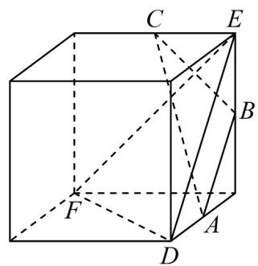
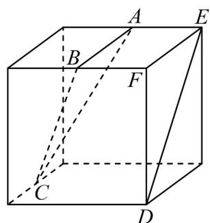
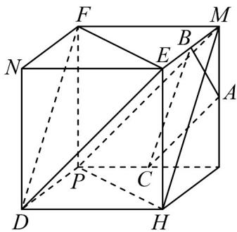

> [!faq]- 《专题8_5_空间直线_平面的平行_高效培优讲义_》官方解析
>
> > [!success]- **【答案】** A  B  C  D 
>
> > [!note]- **【分析】**
> > 对于 $^{A}$ ，根据平面平行的定义，可得其正误；对于 $^{B}$ ，根据中位线定理可得线线平行，再根据面面
> >
> > 平行的判定，可得其正误；对于 $^{C}$ ，利用反证法，结合面面平行的性质，可得其正误；对于 $^{D}$ ，利用反证法，
> >
> > 根据面面平行的判定，可得其正误·
>
> > [!note]- **【解析】**
> > 对于 $^{A}$ 选项，若平面ABC//平面DEF， $BC \subset$ 平面ABC，则 $BC \parallel$ 平面DEF
> >
> > 由图可知 BC 与平面 DEF 相交，故平面 ABC 与平面 DEF 不平行， $^{A}$ 不满足条件；
> >
> > 对于 $^{B}$ 选项，如图所示，连接NG
> >
> > 
> >
> > 因为 $A$ 、 $C$ 分别为 $PN$ 、 $PG$ 的中点，则 $AC \parallel NG$ ，在正方体 $EHDG - MFNP$ 中， $FN \parallel EG$ 且 $FN = EG$
> >
> > 故四边形 EFNG 为平行四边形，所以 $NG \parallel EF$ ，所以 AC//EF
> >
> > 因为 $AC \not\subset$ 平面 DEF ， $EF \subset$ 平面 DEF ， 所以 $AC \parallel$ 平面 DEF ，
> >
> > 同理可证 $BC \parallel$ 平面 DEF ，因为 $AC \cap BC = C$ ，因此，平面 $ABC \parallel$ 平面 DEF ， $^{B}$ 满足条件；
> >
> > 对于 $C$ 选项，如图所示：
> >
> > 
> >
> > 在正方体 PHDG-MNFE 中，若平面 ABC // 平面 DEF，且平面 DEF // 平面 MNHP
> >
> > 平面 ABC 与平面 MNHP 不重合，则平面 ABC // 平面 MNHP，与平面 ABC 与平面 MNHP 相交矛盾，
> >
> > 因此，平面 $ABC$ 与平面 $DEF$ 不平行， $C$ 不满足条件；
> >
> > 对于 $^{D}$ 选项，在正方体PDHG-FNEM中，连接PH、PM、MH，如图所示：
> >
> > 
> >
> > 因为 $DH \parallel FM$ 且 $DH = FM$ ，则四边形 $DHMF$ 为平行四边形，则 $DF \parallel MH$ ，
> >
> > 因为 $DF \notin$ 平面 $PHM$ ， $MH \subset$ 平面 $PHM$ ，所以 $DF //$ 平面 $PHM$ ，
> >
> > 同理可证 $EF \parallel$ 平面 PHM ，因为 $DF \cap EF = F$ ，所以平面 $DEF \parallel$ 平面 PHM ，
> >
> > 若平面 $ABC$ // 平面 $DEF$ ，则平面 $ABC$ // 平面 $PHM$ ，与平面 $ABC$ 与平面 $PHM$ 相交矛盾，
> >
> > 故平面 ABC 与平面 DEF 不平行， $^{D}$ 不满足条件。
> >
> > 故选 **B**.
