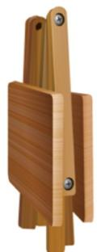
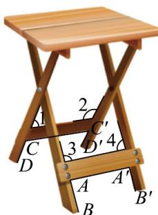

> [!faq]- 《专题8_5_空间直线_平面的平行_高效培优讲义_》官方解析
>
> > [!success]- **【答案】** C
>
> > [!note]- **【分析】**
> > 根据面面平行的判定，考查是否可以得到线线平行，转化为线面平行，得到面面平行。
>
> > [!note]- **【解析】**
> > 项目①，折叠状态下（如图 $^{1}$ ），四条桌腿长相等时，桌面与地面不一定平行；
> >
> > 项目②，打开过程中（如图2），若 $OM = ON = O'M' = O'N'$ ，可以得到线线平行，从而得到面面平行；
> >
> > 项目③，打开过程中（如图2），检查 $OK = OL = O'K' = O'L'$ ，可以得到线线平行，从而得到面面平行；
> >
> > 项目④，打开后（如图 $^{3}$ ），检查 $AB = A'B' = CD = C'D'$ ，桌面与地面不一定平行；
> >
> > 项目⑤，打开后（如图3），检查 $\angle 1 = \angle 2 = \angle 3 = \angle 4 = 90^{\circ}$ ，可以得到线线平行，从而得到面面平行，
> >
> > 
> > 图1
> >
> > 
> > 图2
> >
> > 
> > 图3
> >
> > 故选 **C**.
