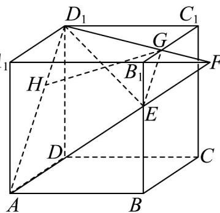

> [!faq]- 《专题8_5_空间直线_平面的平行_高效培优讲义_》官方解析
>
> > [!success]- **【答案】** A. $2\sqrt{11}$ B. $4\sqrt{11}$ C. $2\sqrt{22}$ D. $4\sqrt{22}$
>
> > [!note]- **【分析】**
> > 根据给定条件，结合平面基本事实作出截面，再利用截面的几何特征求其面积·
>
> > [!note]- **【解析】**
> > 在正方体 $ABCD-A_{1}B_{1}C_{1}D_{1}$ 中，延长 $AE, A_{1}B_{1}$ 交于点 F，
> >
> > 连接 $D_{1}F$ 交 $B_{1}C_{1}$ 于点G，如图，
> >
> > 
> >
> > 由平面 $ADD_{1}A_{1} / /$ 平面 $BCC_{1}B_{1}$ ，平面 $AFD_{1}\cap$ 平面 $ADD_{1}A_{1} = AD_{1}$
> >
> > 平面 $AFD_{1} \cap$ 平面 $BCC_{1}B_{1} = EG$
> >
> > 得 $AD_{1} / / GE$ ，又 $AD_{1} = 3\sqrt{2},GE = \sqrt{2}$ ，且 $D_{1}G = AE = \sqrt{13}$
> >
> > 因此四边形 $AEGD_{1}$ 是等腰梯形，且为平面 $AED_{1}$ 截正方体 $ABCD-A_{1}B_{1}C_{1}D_{1}$ 的截面.
> >
> > 在等腰梯形 $AEGD_{1}$ 中，过 $G$ 作 $GH\perp AD_1$ ， $GH = \sqrt{D_1G^2 - D_1H^2} = \sqrt{11}$
> >
> > $S=\frac{1}{2}\cdot(AD_{1}+EG)\cdot GH=\frac{1}{2}\cdot(\sqrt{2}+3\sqrt{2})\cdot\sqrt{11}=2\sqrt{22}$ 所以截面面积
> >
> > 故选 **C**
