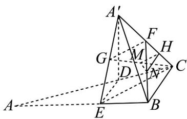
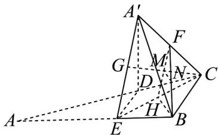
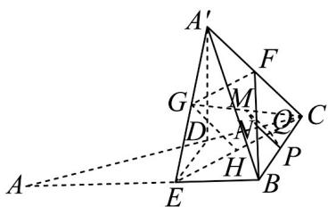

> [!faq]- 《专题8_5_空间直线_平面的平行_高效培优讲义_》官方解析
>
> > [!success]- **【答案】** 证明见解析
>
> > [!note]- **【分析】**
> > 方法 $^{1}$ ：构造面面平行，利用面面平行的性质，证明线面平行；
> >
> > 方法 $^{2}$ ：构造线线平行，利用线面平行的判定定理证明；
> >
> > 方法 $^{3}$ ：构造线线平行，利用线面平行的判定定理证明·
>
> > [!note]- **【解析】**
> > 证法 $^{1}$ ：如图：
> >
> > 
> >
> > 记 $FC$ 的中点为 $H$ ，连接 $MH, NH, FG, CE$
> >
> > 因为 G, F 分别为 $A'E$ ， $A'C$ 的中点，
> >
> > 所以 $GF \parallel CE$ .
> >
> > 又因为 H, M 分别为 FC, GC 的中点，
> >
> > 所以 $MH \parallel GF$ ，所以 $MH \parallel CE$ 。
> >
> > 又因为 $CE \subset$ 平面 $BCDE$ ， $MH \notin$ 平面 $BCDE$ ，所以 $MH \parallel$ 平面 $BCDE$
> >
> > 同理可得 $NH$ $\parallel$ 平面 $BCDE$ ，
> >
> > 因为 $MH \cap NH = H$ ，MH, $NH \subset$ 平面 MNH
> >
> > 所以平面 MNH || 平面 BCDE ，
> >
> > 又因为 $MN \subset$ 平面 $MNH$ ，所以 $MN$ $\parallel$ 平面 $BCDE$ 。
> >
> > 证法 $^{2}$ ：如图，连接FM并延长，交EC于点H，连接HB
> >
> > 
> >
> > 因为 F, M 分别为 $A^{\prime}C$ ，GC 的中点，所以 $FH \parallel A^{\prime}E$ .
> >
> > 所以 H 为 BC 中点·
> >
> > $MF = MH = \frac{1}{4} A'B$ 所以 $M$ 为 $HF$ 的中点
> >
> > 又 N 为 BF 中点，所以 $MN \parallel HB$ .
> >
> > 又 $HB \subset$ 平面 BCDE， $MN \notin$ 平面 BCDE，所以 MN || 平面 BCDE.
> >
> > 证法 $^{3}$ ：如图：
> >
> > 
> >
> > 记 $EC$ 的中点为 $H$ ，分别记 $BC, CH$ 的中点为 $P, Q$ ，连接 $MQ, PQ, NP$
> >
> > 因为 G 为 $A'E$ 中点，所以 $GH \parallel A'C$ ，且 $GH = \frac{1}{2}A'C$ 。
> >
> > 因为 F 为 $A^{\prime}C$ 中点，所以 $GH \parallel FC$ ，且 GH = FC。
> >
> > 因为 $Q$ 为 $CH$ 中点，所以 $MQ_{\parallel GH}$ 且 $MQ = \frac{1}{2} GH$
> >
> > 同理可得： $NP \parallel CF$ 且 $NP = \frac{1}{2}CF$
> >
> > 所以 $MQ \parallel NP$ ，MQ = NP，所以四边形 MQPN 为平行四边形，
> >
> > 所以 $MN \parallel PQ$ ， $PQ \subset$ 平面 BCDE， $MN \notin$ 平面 BCDE，
> >
> > 所以 $MN$ $\parallel$ 平面 $BCDE$ .
