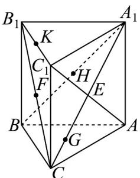
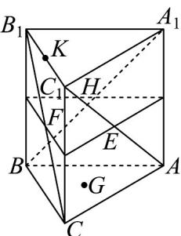
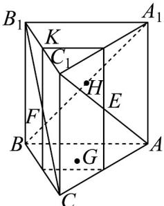
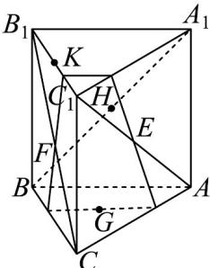

> [!faq]- 《专题8_5_空间直线_平面的平行_高效培优讲义_》官方解析
>
> > [!success]- **【答案】** D
>
> > [!note]- **【分析】**
> > 根据线面平行的关系直接判断得出·
>
> > [!note]- **【解析】**
> > 如图 $^{1}$ ，平面 $EFB_{1}$ 即平面 $A_{1}CB_{1}$ ，只有 $^{1}$ 条棱AB与其平行，所以 $^{A}$ 错误；
> >
> > 如图 $^{2}$ ，对于平面 EFH，有 $^{6}$ 条棱与其平行，它们分别为 AB, BC, CA, $A_{1}B_{1}$ , $B_{1}C_{1}$ , $C_{1}A_{1}$ 。所以 B 错误；
> >
> > 
> > 图1
> >
> > 
> > 图2
> >
> > 如图 $^{3}$ ，对于平面 EFK，有 $^{5}$ 条棱与其平行，它们分别为 $AB, A_{1}B_{1}, AA_{1}, BB_{1}, CC_{1}$ 。所以 C 错误；
> >
> > 如图 $^{4}$ ，平面 EFG 可由平面 EFK 绕直线 EF 旋转得到，有 $^{2}$ 条棱 AB, A₁B₁ 与其平行，其余各棱均与其相交，
> >
> > 所以 $^{D}$ 正确·
> >
> > 
> > 图3
> >
> > 
> > 图4
> >
> > 故选 **D**.
