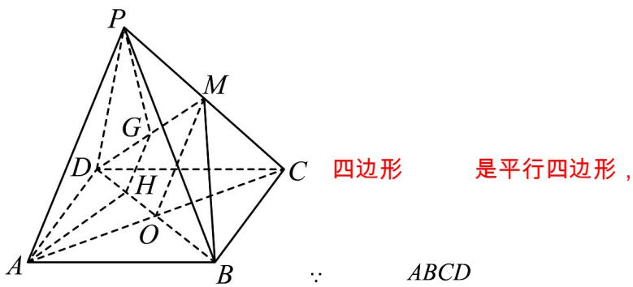

## 知识点 01 直线和平面平行的判定

1、文字语言：直线和平面平行的判定定理：平面外一条直线与此平面内的一条直线平行，则该直线与此平面

平行．简记为：线线平行，则线面平行．

2、图形语言：

3、符号语言： $a \notin \alpha$ 、 $b \subset \alpha$ ， $a \parallel b \Rightarrow a \parallel \alpha$

4、知识点诠释：用该定理判断直线 $a$ 与平面 $\alpha$ 平行时，必须具备三个条件：

①直线 $a$ 在平面 $\alpha$ 外，即 $a\not\subset\alpha$ ；

②直线 b 在平面 $\alpha$ 内，即 $b \subset \alpha$ ；

③直线 a, b 平行，即 $a \parallel b$ .

这三个条件缺一不可，缺少其中任何一个，结论就不一定成立。

【即学即练】

1. 已知长方体 $ABCD - A_1B_1C_1D_1$ 中， $AB = 4$ ， $AD = AA_1 = 3$ .

(1)求证： $B_{1}D_{1}\parallel$ 平面 $BC_{1}D$ ；

(2)求三棱锥 $C - BDC_{1}$ 的体积.

【答案】(1)证明见解析

(2)6

【分析】（ $^{1}$ ）由平行四边形可得线线平行，再由线面平行的判定定理得证；

(2) 根据棱锥的体积公式求解即可·

【详解】（1）在长方体 $ABCD - A_{1}B_{1}C_{1}D_{1}$ 中，

可得 $DD_{1} \parallel BB_{1}$ 且 $DD_{1} = BB_{1}$

所以四边形 $DD_{1}B_{1}B$ 是平行四边形

所以 $D_{1}B_{1} \parallel DB$

且 $D_{1}B_{1}\notin$ 平面 $DBC_{1}$ ， $DB\subset$ 平面 $DBC_{1}$

所以 $B_{1}D_{1}\parallel$ 平面 $BC_{1}D$ .

(2) 在长方体 $ABCD - A_{1}B_{1}C_{1}D_{1}$ 中，

$$
A B = 4, A D = A A = 3 \text {, 且} C C _ {1} \perp \text {平面} A B C D
$$

$$
\therefore V _ {C - B D C _ {1}} = V _ {C _ {1} - B D C}
$$

$$
V _ {C _ {1} - B D C} = \frac {1}{3} \cdot S _ {\triangle B D C} \cdot C C _ {1} = \frac {1}{3} \times \left(\frac {1}{2} \times 3 \times 4\right) \times 3 = 6.
$$

2．如图所示，在四棱锥 P-ABCD 中，底面 ABCD 是平行四边形，AC 与 BD 交于点 O，M 是 PC 的中点，

在 $DM$ 上取一点 $G$ ，过 $G$ 和 $AP$ 作平面交平面 $BDM$ 于 $GH$ ，求证： $AP \parallel GH$ .

【答案】证明见解析

【分析】先证明线面平行，由 $AP \parallel$ 平面 BDM 的性质可得 $AP \parallel GH$ .

【详解】证明：如图，连接 $OM$ ·$\therefore O_{\text{是}} AC$ 的中点.

又∵ M 是 PC 的中点，∴ $AP \parallel OM$ .

又∵ $AP \not\subset$ 平面 BDM ， $OM \subset$ 平面 BDM ， ∴ $AP \parallel$ 平面 BDM ·

又∵ $AP \subset$ 平面 APGH ，平面 $APGH \cap$ 平面 BDM = GH

$\therefore AP \parallel GH$
