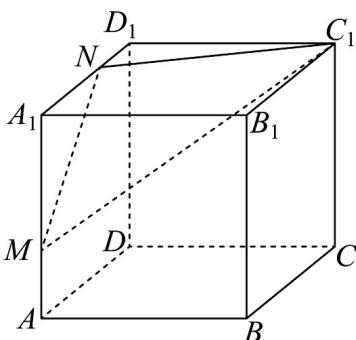

## 知识点 02 两平面平行的判定

1、文字语言：如果一个平面内有两条相交直线与另一个平面平行，则这两个平面平行。

2、图形语言：

3、符号语言：若 $a \subset \alpha$ 、 $b \subset \alpha$ ， $a \cap b = A$ ，且 $a // \beta$ 、 $b // \beta$ ，则 $\alpha // \beta$

4、知识点诠释：

(1) 定理中平行于同一个平面的两条直线必须是相交的.

(2) 定理充分体现了等价转化的思想，即把面面平行转化为线面平行，可概述为：线面平行 $\Rightarrow$ 面面平行。

【即学即练】

1．三棱柱 $ABC-A_{1}B_{1}C_{1}$ 中，D,E 分别为 AB,AC 中点．若过 DE 的平面交 $A_{1}C_{1}$ 于 $E_{1}$ ，且 $BC_{1} //$ 平面 $E_{1}DE$ ，则

平面 $E_{1}DE / /$ 平面 $BCC_{1}B_{1}$ 成立吗？

【答案】成立

【分析】连接 $AC_{1}$ 交 $E_{1}E$ 于点 $F$ ，连接 $DF$ ，由 $BC_{1} / /$ 平面 $E_{1}DE$ 推得 $BC_{1} / / DF$ ，由线线平行可得 $DF / /$ 平面

$BCC_{1}B_{1}$ ，结合条件可得 $DE \parallel$ 平面 $BCC_{1}B_{1}$ ，由线面平行可证得面面平行。

【详解】

如图，连接 $AC_{1}$ 交 $E_{1}E$ 于点 F，连接 DF，因 $BC_{1} //$ 平面 $E_{1}DE$ ， $BC_{1} \subset$ 平面 $ABC_{1}$ ，

平面 $ABC_{1}\mathrm{I}$ 平面 $E_{1}DE = DF$ ，故 $BC_{1} / / DF$ ，又因 $DF\notin$ 平面 $BCC_{1}B_{1}$ ， $BC_{1}\subset$ 平面 $BCC_{1}B_{1}$

则 $DF \parallel$ 平面 $BCC_{1}B_{1}$ ，又 $D, E$ 分别为 $AB, AC$ 中点，则 $DE \parallel BC$ ，

因 $DE \notin$ 平面 $BCC_{1}B_{1}$ ， $BC \subset$ 平面 $BCC_{1}B_{1}$ ，则 $DE //$ 平面 $BCC_{1}B_{1}$ ，又 $DE \cap DF = D, DE, DF \subset$ 平面 $E_{1}DE$

故平面 $E_{1}DE \parallel$ 平面 $BCC_{1}B_{1}$

故结论成立.

2．如图，正方体 $ABCD-A_{1}B_{1}C_{1}D_{1}$ 的棱长为 3，点 M，N 分别在棱 $AA_{1}$ ， $A_{1}D_{1}$ 上，满足 $AM=D_{1}N=1$ ，点 Q

在正方体 $ABCD - A_1B_1C_1D_1$ 的内部或表面，且 $A_1Q //$ 平面 $C_1MN$ ，则点 $Q$ 组成的图形的面积是\_\_\_\_。

【答案】 $\frac{\sqrt{19}}{2}/\frac{1}{2}\sqrt{19}$

【分析】在 $B_{1}B, B_{1}C_{1}$ 上取点 $E, F$ ，使得 $BB_{1} = 3EB_{1}, B_{1}C_{1} = 3B_{1}F$ ，证得平面 $A_{1}EF // \text{平面 } C_{1}NM$ ，得到点 $Q$ 的轨

迹组成的图形为 $\triangle A_{1}EF$ ，在等腰三角形 $A_{1}EF$ 中，求得底边 $EF$ 上的高，即可求解

【详解】在 $B_{1}B, B_{1}C_{1}$ 上取点 E, F ，使得 $BB_{1} = 3EB_{1}, B_{1}C_{1} = 3B_{1}F$

分别连结 $EF, BC_{1}, AD_{1}$

因为 $A_{1}D_{1}=3D_{1}N$ ，可得 $A_{1}N//C_{1}F$ ，且 $A_{1}N=C_{1}F$ ，

所以四边形 $A_{1}FC_{1}N$ 为平行四边形，所以 $C_1N // A_1F$

由 $BB_{1} = 3EB_{1}$ 且 $B_{1}C_{1} = 3B_{1}F$ ，可得 $EF / / BC_{1}$

又由 $AA_{1} = 3AM$ 且 $A_{1}D_{1} = 3D_{1}N$ ，所以 $MN / / AD_{1}$

在正方体 $ABCD - A_{1}B_{1}C_{1}D_{1}$ 中，可得 $AD_{1} // BC_{1}$ ，所以 $EF // MN$ ，

因为 $A_{1}F \notin$ 平面 $C_{1}NM$ ，且 $C_{1}N \subset$ 平面 $C_{1}NM$ ，所以 $A_{1}F //$ 平面 $C_{1}NM$

同理可证 $EF$ // 平面 $C_1NM$

又因为 $A_{1}F \cap EF = F$ ，且 $A_{1}F, EF \subset$ 平面 $A_{1}EF$ ，所以平面 $A_{1}EF //$ 平面 $C_{1}NM$

因此点 $Q$ 的轨迹组成的图形为 $\triangle A_{1}EF$

在等腰三角形 $A_{1}EF$ 中， $A_{1}F = A_{1}E = \sqrt{10}, EF = \sqrt{2}$

可得底边 EF 上的高为 $\sqrt{A_{1}F^{2}-\left(\frac{EF}{2}\right)^{2}}=\frac{\sqrt{38}}{2}$

所以面积为 $\frac{1}{2} \times \sqrt{2} \times \frac{\sqrt{38}}{2} = \frac{\sqrt{19}}{2}$

故答案为： $\frac{\sqrt{19}}{2}$

