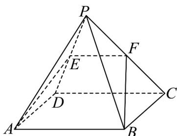

## 知识点 04 直线和平面平行的性质

1、文字语言：一条直线与一个平面平行，则过这条直线的任一平面与此平面的交线与该直线平行．简记为：

线面平行则线线平行.

2、符号语言：若 $a / / \alpha$ ， $a\subset \beta$ ， $\alpha \cap \beta = b$ ，则 $a / / b$ ：

3、图形语言：

4、知识点诠释：

直线和平面平行的性质定理可简述为“若线面平行，则线线平行”。可以用符号表示：若 $a\| \alpha$ ， $\alpha \subset \beta$

$\alpha \cap \beta = b$ ，则 $a\| b$ .这个性质定理可以看作直线与直线平行的判定定理，用该定理判断直线 $a$ 与 $b$ 平行时，

必须具备三个条件：

(1) 直线 a 和平面 $\alpha$ 平行，即 $a \parallel \alpha$ ;

(2) 平面 $\alpha$ 和 $\beta$ 相交，即 $\alpha \cap \beta = b$ ；

(3) 直线 $a$ 在平面 $\beta$ 内，即 $a \subset \beta$ 。三个条件缺一不可，在应用这个定理时，要防止出现“一条直线平行于

一个平面，就平行于这个平面内一切直线”的错误。

【即学即练】

1．如图，在正方体 $ABCD-A_{1}B_{1}C_{1}D_{1}$ 中，E，H 分别为 $DD_{1}$ ，AB 的中点，点 F,G 分别在线段 BC， $CC_{1}$ 上，

且 $CF = CG = \frac{1}{4} BC$ ，则在 $F,G,H$ 这三点中任取两点确定的直线中，与平面 $ACE$ 平行的条数为

【答案】1

【分析】根据线面平行判定定理得出 $GH //$ 平面 $ACE$ ，再应用线面平行性质定理得出 $HF // AC$ 及 $FG // IN$

即可判断·

【详解】如图，取 $CE, CC_{1}$ 的中点I,M，IG//EM且 $IG=\frac{1}{2}EM$

又 $AH // EM$ 且 $AH = \frac{1}{2} EM$ ，所以 $AH // IG$ 且 $AH = IG$ ，四边形 $AHGI$ 为平行四边形，则 $GH // AI$ ：

又 $GH \not\subset$ 平面 ACE ， $AI \subset$ 平面 ACE ， 故 $GH \parallel$ 平面 ACE ；

若 $HF / /$ 平面 $ACE$ ， $HF \subset$ 平面 $ABCD$ ，平面 $ABCD \cap$ 平面 $ACE = AC$ ，则 $HF / / AC$ ，矛盾；

过点 $F$ 作 $FN / / AB$ 交 $AC$ 于点 $N$ ，连结 $IN$ ， $CF = \frac{1}{4} CB$ ，则 $FN = \frac{1}{4} AB$

若 $FG / /$ 平面 $ACE$ ， $FG \subset$ 平面 $FGIN$ ，平面 $FGIN \cap$ 平面 $ACE = IN$ ，故 $FG / / IN$

又 $IG / / FN$ ，则四边形FGIN是平行四边形，但 $IG = \frac{1}{2} AB\neq NF$ ，矛盾.

故在 $F, G, H$ 这三点中任取两点确定的直线中，与平面 $ACE$ 平行的有 1 条。

故答案为：1.

2. 四棱锥 $P - ABCD$ 中底面 $ABCD$ 是平行四边形， $E$ 是 $PD$ 中点，平面 $EAB$ 与 $PC$ 交于 $F$ .

(1)求证： $CD / /$ 平面 $EAB$ ：

(2)求证： $F$ 是 $PC$ 中点.

【答案】 $^{(1)}$ 证明见解析

(2)证明见解析

【分析】（1）即证 $AB // CD$ ，利用线面平行的判定定理即可得证；

(2) 由 (1) 有 $CD //$ 平面 $EAB$ ，利用线面平行的性质定理即可得 $CD //EF$ ，进而得证·

【详解】（1）由底面ABCD是平行四边形，所以 $AB \parallel CD$

又 $AB \subset$ 平面 $EAB, CD \notin$ 平面 $EAB$

所以 $CD / /$ 平面 $EAB$ ；

(2) 由 (1) 有 CD // 平面 EAB，

又 $CD \subset$ 平面 PCD ，平面 $EAB \cap$ 平面 PCD = EF ，

所以 $CD / / EF$ ，

又 E 是 PD 中点，

所以 F 是 PC 中点·
