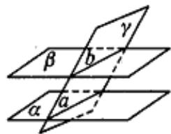

## 知识点 05 平面和平面平行的性质

1、文字语言：如果两个平行平面同时与第三个平面相交，那么它们的交线平行。

2、符号语言：若 $\alpha // \beta$ ， $\alpha \cap \gamma = a$ ， $\beta \cap \gamma = b$ ，则 $a // b$ 。

3、图形语言：

4、知识点诠释：

（1）面面平行的性质定理也是线线平行的判定定理.

（2）已知两个平面平行，虽然一个平面内的任何直线都平行于另一个平面，但是这两个平面内的所有直线并

不一定相互平行，它们可能是平行直线，也可能是异面直线，但不可能是相交直线（否则将导致这两个平面

有公共点）.

【即学即练】

1. 如图，在棱长为 $^{2}$ 的正方体 $ABCD-A_{1}B_{1}C_{1}D_{1}$ 中，P 为 $DD_{1}$ 的中点，Q 为正方形 $AA_{1}D_{1}D$ 内一动点，且

$B_{1}Q//$ 平面 $BC_{1}P$ ，则点 Q 的轨迹的长度为 \_\_\_\_。

【答案】 $\sqrt{2}$

【分析】两次应用线面平行判定定理得出 $B_{1}GH\parallel$ 平面 $BC_{1}P$ ，进而得出点 Q 的轨迹为线段 GH，计算即可求

解·

【详解】如图，分别取 $AA_{1}$ ， $A_{1}D_{1}$ 的中点 H, G，连接 $B_{1}G$ ，GH， $HB_{1}$ ， $AD_{1}$ ，HP，

因为 $P$ 为 $DD_{1}$ 的中点，得 $HP / / A_{1}D_{1} / / B_{1}C_{1}$ ， $HP = A_{1}D_{1} = B_{1}C_{1}$ ，则四边形 $HPC_{1}B_{1}$ 是平行四边形，故 $B_{1}H / / PC_{1}$

因为 $B_{1}H \subset$ 平面 $B_{1}GH$ ， $PC_{1} \notin$ 平面 $B_{1}GH$ ，故 $PC_{1} / /$ 平面 $B_{1}GH$

又因为 $AB / / A_{1}B_{1} / / D_{1}C_{1}$ ， $AB = A_{1}B_{1} = D_{1}C_{1}$ ，则四边形 $ABC_{1}D_{1}$ 是平行四边形，故 $BC_{1} / / AD_{1}$

因为 $GH \parallel AD_{1}$ ，故 $BC_{1} \parallel GH$ ，又 $BC_{1} \not\subset$ 平面 $B_{1}GH$ ，GH $\backslash$ 平面 $B_{1}GH$ ，可得 $BC_{1} \parallel$ 平面 $B_{1}GH$ ，

且 $PC_{1} \cap BC_{1} = C_{1}$ ， $PC_{1}, BC_{1} \subset$ 平面 $BC_{1}P$ ，故平面 $B_{1}GH //$ 平面 $BC_{1}P$

又因为 $B_{1}Q / /$ 平面 $BC_{1}P$ ，故 $B_{1}Q \subset$ 平面 $B_{1}GH$ ，故点 $Q$ 的轨迹为线段 $GH$ ，其长为 $\sqrt{2}$

故答案为： $\sqrt{2}$

2. 设 $\alpha, \beta$ 是两个不同的平面，m 是直线且 $m \subset \beta$ ，则“ $m // \alpha$ ”是“ $\alpha // \beta$ ”的（）

【答案】
A．充分而不必要条件
B．必要而不充分条件
C．充要条件
D．既不充分也不必要条件

【答案】B

【分析】由面面平行的判定定理与性质定理判断充分性和必要性即可·

【详解】先验证充分性：当 $m \subset \beta$ 且 $m // \alpha$ 时，若 $\alpha$ 与 $\beta$ 相交，则得到 $m$ 与两平面交线平行，故 $\alpha // \beta$ 不一定

成立，即充分性不成立；

再验证必要性：当 $m \subset \beta$ 且 $\alpha // \beta$ 时， $m // \alpha$ ，必要性成立。

综上，在给定条件下，“ $m // \alpha$ ”是“ $\alpha // \beta$ ”的必要不充分条件。

故选：B.
