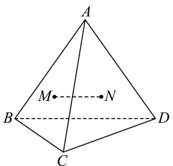

<!-- question-source:start -->
【变式1】如图， $A$ 是 $\triangle BCD$ 所在平面外一点， $M$ ， $N$ 分别是VABC和 $\triangle ACD$ 的重心，若 $BD = 6$ ，则MN的

长为（ ）

A. 2 B. $\frac{2}{3}$ C. 1 D. $\frac{3}{2}$
<!-- question-source:end -->

![[高中/课堂同步/题库/人教A版高中数学同步讲义(2026)/02_必修第二册/第八章 立体几何初步/讲义/专题8_5_空间直线_平面的平行_高效培优讲义_/题型01_证明两直线平行_sec_10/questions/answers/Q00065209A1.md]]
