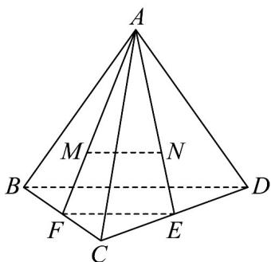

> [!faq]- 《专题8_5_空间直线_平面的平行_高效培优讲义_》官方解析
>
> > [!success]- **【答案】** A
>
> > [!note]- **【分析】**
> > 若 $E, F$ 为 $CD, CB$ 的中点，连接 $AE, AF$ ，根据重心的性质 $\frac{AM}{AF} = \frac{AN}{AE} = \frac{MN}{EF} = \frac{2}{3}$ ，且 $\frac{EF}{BD} = \frac{1}{2}$ ，即可
> >
> > 得·
>
> > [!note]- **【解析】**
> > 由 M, N 分别是 VABC 和 $\triangle ACD$ 的重心，则 M, N 为三角形中线的交点，
> >
> > 若 $E,F$ 为 $CD,CB$ 的中点，连接 $AE,AF$ ，则 $M,N$ 分别在 $AF,AE$ 上， $\frac{AM}{AF} = \frac{AN}{AE} = \frac{MN}{EF} = \frac{2}{3}$
> >
> > 而 BD = 6， $\frac{EF}{BD} = \frac{1}{2} \Rightarrow EF = 3$ ，故 MN = 2。
> >
> > 故选：A
> >
> > 
