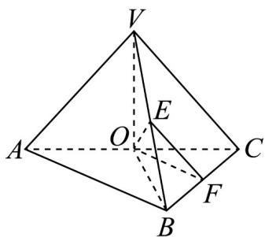
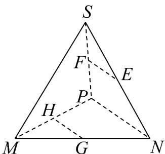

> [!faq]- 《专题8_5_空间直线_平面的平行_高效培优讲义_》官方解析
>
> > [!success]- **【答案】** (1)证明见解析 (2) $\frac{13}{32}$
>
> > [!note]- **【分析】**
> > （1）根据异面直线的定义，结合点 $B \in$ 平面VBC，点 $A \notin$ 平面VBC，即可判断；
> >
> > (2) 取 $AC$ 的中点 $O$ ，连接 $FO$ ， $OE$ ，根据平行关系可证明异面直线 $AB$ 与 $EF$ 所成角为 $\angle EFO$ （或其补
> >
> > 角），结合余弦定理可得解·
>
> > [!note]- **【解析】**
> > （1）因为直线 $VC \subset$ 平面 VBC，点 $B \in$ 平面 VBC，
> >
> > 点 $B \notin VC$ ，点 $A \notin$ 平面 $VBC$ ，所以直线 $AB$ 与直线 $VC$ 是异面直线。
> >
> > (2) 如图：取 AC 的中点 O，连接 FO，OE，
> >
> > 因为 E 为 VB 的中点，F 为 BC 的中点，
> >
> > 所以 $AB//OF$ ，VC//EF，
> >
> > 所以异面直线 AB 与 EF 所成角 $\angle EFO$ （或其补角），
> >
> > 因为 $VC = VA = BA = BC = AC = 2$ ，所以 $OF = 1$ ， $EF = 1$
> >
> > 在 $\triangle O B$ 中， $V O = \sqrt{3}, O B = \sqrt{3}, V B = \frac{\sqrt{3}}{2}$ ，则 $O E \perp V B$
> >
> > 所以 $OE = \sqrt{OV^{2} - \left(\frac{VB}{2}\right)^{2}} = \sqrt{3 - \frac{3}{16}} = \sqrt{\frac{45}{16}}$ ，即 $OE^{2} = \frac{45}{16}$
> >
> > 在 $\triangle EOF$ 中由余弦定理得 $\cos\angle EFO=\frac{EF^{2}+FO^{2}-OE^{2}}{2EF\cdot OF}=\frac{1+1-\frac{45}{16}}{2\times1\times1}=-\frac{13}{32}$
> >
> > 因为异面直线所成角范围为 $\left(0,\frac{\pi}{2}\right]$ ，所以异面直线 AB 与 EF 所成角的余弦值为 $\frac{13}{32}$ 【变式3】如图所示，在三棱锥 $S - MNP$ 中， $E, F, G, H$ 分别是棱 $SN, SP, MN, MP$ 的中点，则 $EF$ 与 $HG$ 的位置关系是（）
> >
> > 
> >
> > 
> >
> > A. 平行 B. 相交 C. 异面 D. 平行或异面
> >
> > 【答案】A
> >
> > 【分析】利用中位线定理与平行线的传递性即可得解·
> >
> > 【详解】因为 E，F 分别是棱 SN，SP 的中点，所以 EF // NP
> >
> > 因为 G，H 分别是棱 MN，MP 的中点，所以 HG // NP
> >
> > 所以 EF // HG.
> >
> > 故选 **A**.
