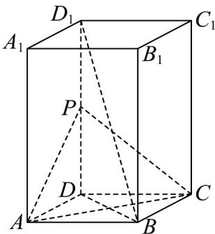

<!-- question-source:start -->
【变式1】如图，长方体 $ABCD - A_{1}B_{1}C_{1}D_{1}$ 中， $AB = AD = 2, AA_{1} = 4$ ，点 $P$ 为 $DD_{1}$ 的中点.

(1)求证：直线 $BD_{1} / /$ 平面PAC；

(2)求异面直线 $BD_{1}$ 与 $PC_{1}$ 所成角的余弦值.
<!-- question-source:end -->

![[高中/课堂同步/题库/人教A版高中数学同步讲义(2026)/02_必修第二册/第八章 立体几何初步/讲义/专题8_5_空间直线_平面的平行_高效培优讲义_/题型03_直线与平面平行的判定_sec_12/questions/answers/Q00065214A1.md]]
