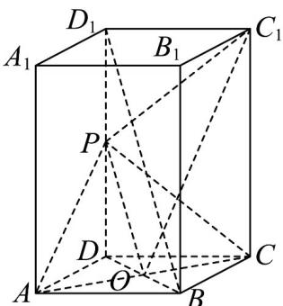

> [!faq]- 《专题8_5_空间直线_平面的平行_高效培优讲义_》官方解析
>
> > [!success]- **【答案】** (1)证明见解析 (2) $\frac{\sqrt{3}}{6}$
>
> > [!note]- **【分析】**
> > （1）设 $AC \cap BD = O$ ，求证 $OP \parallel D_{1}B$ ，再利用线面平行的判定定理判定即可；
> >
> > (2) 将问题转化为求 $\angle OPC_{1}$ 或其补角的余弦值，利用余弦定理计算即可.
>
> > [!note]- **【解析】**
> > （1）设 $AC \cap BD = O$ ，连接 OP，
> >
> > 因 $AB = AD = 2$ ，且 $ABCD - A_{1}B_{1}C_{1}D_{1}$ 为长方体，
> >
> > 则四边形 $ABCD$ 为正方形，故 $O$ 为线段 $AC$ 中点，
> >
> > 因点 P 为 $DD_{1}$ 的中点，则 OP 为 $\Delta D_{1}DB$ 的中位线，则 $OP \parallel D_{1}B$
> >
> > 又 $OP \subset$ 平面 PAC ， $D_{1}B \not\subset$ 平面 PAC ，则 $D_{1}B //$ 平面 PAC .
> >
> > (2) 连接 $PC_{1}, OC_{1}$ ，由 (1) 可知 $OP \parallel D_{1}B$ ，则直线 $BD_{1}$ 与 $PC_{1}$ 所成角是 $\angle OPC_{1}$ 或其补角，
> >
> > 因 AB = AD = 2, $AA_{1} = 4$ ，点 P 为 $DD_{1}$ 的中点，
> >
> > 则 $OC = OD = \frac{1}{2} BD = \sqrt{2}$ ， $DP = D_{1}P = 2$
> >
> > 在 Rt△PDO 中， $PO=\sqrt{DP^{2}+OD^{2}}=\sqrt{2^{2}+\left(\sqrt{2}\right)^{2}}=\sqrt{6}$
> >
> > 在 $\mathrm{Rt}^{\triangle}D_{1}PC_{1}$ 中， $PC_{1} = \sqrt{D_{1}P^{2} + D_{1}C_{1}^{2}} = \sqrt{2^{2} + 2^{2}} = 2\sqrt{2}$
> >
> > 在 $\mathrm{Rt}\triangle COC_1$ 中， $OC_{1} = \sqrt{C_{1}C^{2} + OC^{2}} = \sqrt{4^{2} + (\sqrt{2})^{2}} = 3\sqrt{2}$
> >
> > 在 $\triangle PC_{1}O$ 中由余弦定理得， $\cos \angle OPC_{1} = \frac{C_{1}P^{2} + OP^{2} - C_{1}O^{2}}{2C_{1}P \cdot OP} = \frac{8 + 6 - 18}{2 \times 2\sqrt{2} \times \sqrt{6}} = -\frac{\sqrt{3}}{6}$
> >
> > 故直线 $BD_{1}$ 与 $PC_{1}$ 所成角的余弦值为 $\frac{\sqrt{3}}{6}$ .
> >
> > 
