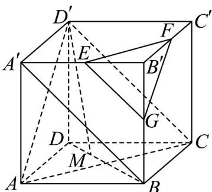
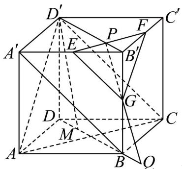

> [!faq]- 《专题8_5_空间直线_平面的平行_高效培优讲义_》官方解析
>
> > [!success]- **【答案】** $^{(1)}$ 证明见详解 (2) $\left[\frac{3\sqrt{2}}{2},\sqrt{6}\right]$
>
> > [!note]- **【分析】**
> > （1）连接 $A'B$ ，由题可得 $EG//D'C$ ，根据线面平行的判定即可证明；
> >
> > (2) 设 $EF, B'D'$ 交于点 $P$ ，连接 $PG$ 并延长交 $DB$ 的延长线于 $Q$ ，由题可证四边形 $PQMD'$ 为平行四边形，得
> >
> > 到 $D^{\prime}P = MQ = \frac{3\sqrt{2}}{2}$ ，利用 $\triangle PB'G\sim \triangle QBG$ ，可得 $BQ = \frac{\sqrt{2}}{2a} -\frac{\sqrt{2}}{2}$ ，继而得到 $DM = \frac{\sqrt{2}}{2a}$
> >
> > $D^{\prime}M=\sqrt{4+\frac{1}{2a^{2}}}\in\left[\frac{3\sqrt{2}}{2},\sqrt{6}\right]$ 即可.
>
> > [!note]- **【解析】**
> > （1）证明：连接 $A'B$ ， $a=0.5$ ， $B'G=\frac{1}{2}B'B$ ，则 $G$ 为 $BB'$ 中点，
> >
> > 
> >
> > 又 E 为 $A'B'$ 的中点，所以 $EG//A'B$ ，
> >
> > 在正方体中， $D^{\prime}C//A^{\prime}B$ ，所以 $EG//D^{\prime}C$ ，又 $EG\not\subset$ 平面 $D^{\prime}AC$ ， $D^{\prime}C\subset$ 平面 $D^{\prime}AC$ ，所以 $EG//$ 平面 $D^{\prime}AC$ 。
> >
> > (2) 设 $EF, B'D'$ 交于点 $P$ ，连接 $PG$ 并延长交 $DB$ 的延长线于 $Q$
> >
> > 
> >
> > 平面，平面，平面 平面
> >
> > $$
> > D ^ {\prime} M / /
> > $$
> >
> > $$
> > D ^ {\prime} M \subset
> > $$
> >
> > $$
> > B B ^ {\prime} D ^ {\prime} D
> > $$
> >
> > $$
> > B B ^ {\prime} D ^ {\prime} D \cap
> > $$
> >
> > $$
> > E F G = P Q
> > $$
> >
> > $\therefore D^{\prime}M//PQ$ $D^{\prime}P//MQ$ $PQMD'$ 又，所以四边形为平行四边形，
> >
> > 则 $D^{\prime}P = MQ = \frac{3\sqrt{2}}{2}$ ，又 $\triangle PB^{\prime}G\sim \triangle QBG$ ，所以 $\frac{PB^{\prime}}{BQ} = \frac{B^{\prime}G}{BG}$
> >
> > 又 $PB'=\frac{\sqrt{2}}{2}, B'G=aB'B=2a, BG=2-2a$ ，所以 $BQ=\frac{\sqrt{2}}{2a}-\frac{\sqrt{2}}{2}$ ，
> >
> > $BM = \frac{3\sqrt{2}}{2} -\left(\frac{\sqrt{2}}{2a} -\frac{\sqrt{2}}{2}\right) = 2\sqrt{2} -\frac{\sqrt{2}}{2a},DM = \frac{\sqrt{2}}{2a},$
> >
> > 所以 $D'M = \sqrt{4 + \frac{1}{2a^{2}}}$ ，因 $a \in \left[\frac{1}{2}, 1\right]$ ，则可得 $\frac{1}{2} \leq \frac{1}{2a^{2}} \leq 2, \Rightarrow \frac{3\sqrt{2}}{2} \leq D'M \leq \sqrt{6}$ .
