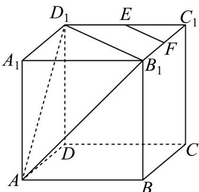

## 题型03 直线与平面平行的判定

【典例1】如图，在正方体 $ABCD - A_{1}B_{1}C_{1}D_{1}$ 中，点 $E$ ， $F$ 分别为棱 $C_1D_1$ ， $C_1B_1$ 的中点

(1)证明： $EF \parallel$ 平面 $AB_{1}D_{1}$ ；

(2)求直线 $AD_{1}$ 与直线 EF 所成的角的大小.

【答案】(1)证明过程见解析

(2) $60^{\circ}$

【分析】（1）只需证明 $EF // B_{1}D_{1}$ ，再结合线面平行的判定定理即可得证；

(2) 将所求转换为直线 $AD_{1}$ 与直线 $D_{1}B_{1}$ 所成的角的大小，结合等边三角形的内角即可求解.

【详解】（1）因为点 $E$ ， $F$ 分别为棱 $C_1D_1$ ， $C_1B_1$ 的中点，

所以 $EF // B_{1}D_{1}$

又因为 $EF \notin$ 平面 $AB_{1}D_{1}$ ， $B_{1}D_{1} \subset$ 平面 $AB_{1}D_{1}$

所以 EF // 平面 $AB_{1}D_{1}$ ;

(2) 设正方体棱长为 $a, (a > 0)$ ，由勾股定理可得 $AD_{1} = D_{1}B_{1} = B_{1}A = \sqrt{2} a$

所以三角形 $AD_{1}B_{1}$ 是边长为 $\sqrt{2}a$ 的等边三角形，

所以直线 $AD_{1}$ 与直线 $D_{1}B_{1}$ 所成的角的大小为 $60^{\circ}$

因为 $EF // B_{1}D_{1}$

所以直线 $AD_{1}$ 与直线 EF 所成的角的大小为 $60^{\circ}$

## 方法技巧

判定定理应用的注意事项

(1) 欲证线面平行可转化为线线平行解决.

(2) 判断定理中有三个条件，缺一不可，注意平行关系的寻求．常常利用平行四边形、三角形中位线、等比

例线段、相似三角形．

![[高中/课堂同步/题库/人教A版高中数学同步讲义(2026)/02_必修第二册/第八章 立体几何初步/讲义/专题8_5_空间直线_平面的平行_高效培优讲义_/题型03_直线与平面平行的判定_sec_12/questions/Q00065214.md]]
![[高中/课堂同步/题库/人教A版高中数学同步讲义(2026)/02_必修第二册/第八章 立体几何初步/讲义/专题8_5_空间直线_平面的平行_高效培优讲义_/题型03_直线与平面平行的判定_sec_12/questions/Q00065215.md]]
![[高中/课堂同步/题库/人教A版高中数学同步讲义(2026)/02_必修第二册/第八章 立体几何初步/讲义/专题8_5_空间直线_平面的平行_高效培优讲义_/题型03_直线与平面平行的判定_sec_12/questions/Q00065216.md]]
