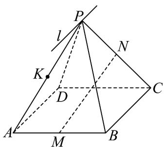

<!-- question-source:start -->
【变式3】如图所示，已知点 $P$ 是平行四边形ABCD所在平面外一点， $M$ 、 $N$ 、 $K$ 分别为 $AB$ 、 $PC$ 、 $PA$ 的

中点，平面 $PBC \cap$ 平面 $APD = l$ .

(1) 判断直线 l 与 BC 的位置关系并证明；

(2)求证： $MN / /$ 平面PAD；
<!-- question-source:end -->

![[高中/课堂同步/题库/人教A版高中数学同步讲义(2026)/02_必修第二册/第八章 立体几何初步/讲义/专题8_5_空间直线_平面的平行_高效培优讲义_/题型04_直线与平面平行的性质_sec_13/questions/answers/Q00065219A1.md]]
