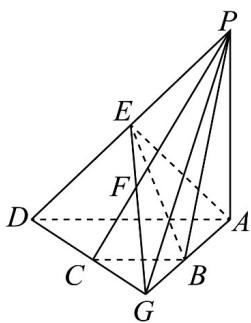

> [!faq]- 《专题8_5_空间直线_平面的平行_高效培优讲义_》官方解析
>
> > [!success]- **【答案】** A
>
> > [!note]- **【分析】**
> > 延长 DC，AB 交于 G，连接 GP，连接 GE 交 PC 于点 F，由题意可得出 F 是 $\triangle PDG$ 的重心，可得
> > CF = $\frac{1}{3} CP$ ，即可得出答案.
>
> > [!note]- **【解析】**
> > 延长 DC，AB 交于 G，连接 GP，连接 GE 交 PC 于点 F，
> > 则由 BC//AD，AD = 2BC，得 C 是 DG 中点，
> > ∵ E 是 PD 中点，∴ F 是 $\triangle PDG$ 的重心，
> >
> > $\therefore CF=\frac{1}{3}CP$ ，即 $\lambda=3$ .
> >
> > 故选：A.
> >
> > 
