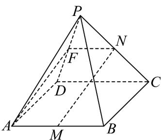

> [!faq]- 《专题8_5_空间直线_平面的平行_高效培优讲义_》官方解析
>
> > [!success]- **【答案】** (1) $l//BC$ ，证明见解析 (2)证明见解析
>
> > [!note]- **【分析】**
> > （1）利用线面平行的判定定理证明 $BC / /$ 平面PAD，再由线面平行的性质定理证明即可·
> >
> > (2) 取 $PD$ 中点 $F$ ，证明四边形 $AFNM$ 为平行四边形，利用线面平行的判定定理证明即可
>
> > [!note]- **【解析】**
> > （1） $l//BC$ ·证明如下：
> >
> > 因为四边形 ABCD 为平行四边形，所以 BC // AD
> >
> > 因为 $AD \subset$ 平面 $PAD$ ， $BC \notin$ 平面 $PAD$ ，则 $BC //$ 平面 $PAD$
> >
> > 又平面 $PAD \cap$ 平面 PBC = l ， $BC \subset$ 平面 PBC ，所以 l // BC .
> >
> > (2) 取 PD 中点 F，连接 AF、FN，
> >
> > 
> >
> > 因为 $F$ 、 $N$ 分别为 $PD$ 、 $PC$ 的中点，所以 $FN//CD$ 且 $FN = \frac{1}{2} CD$
> >
> > 因为四边形 ABCD 为平行四边形，所以 $AB \parallel CD$ 且 AB = CD ，
> >
> > 因为 $M$ 为 $AB$ 的中点，所以 $AM \parallel CD$ 且 $AM = \frac{1}{2} CD$
> >
> > 所以 $AM // FN$ ，故四边形 $AFNM$ 为平行四边形，故 $MN // AF$
> >
> > 因为 $AF \subset$ 平面 $PAD$ ， $MN \notin$ 平面 $PAD$ ，所以 $MN //$ 平面 $PAD$ .
