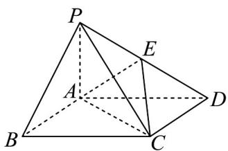
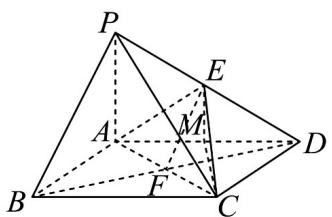

## 题型04 直线与平面平行的性质

【典例1】如图，四棱锥 $P - ABCD$ 中，底面 $ABCD$ 为矩形， $PA \perp$ 平面 $ABCD, AB = AP = 1$

$$
A D = 2, \stackrel {\sqcup \sqcup \sqcup} {D E} = \lambda \stackrel {\sqcup \sqcup \sqcup} {D P} (0 <   \lambda <   1)
$$

(1)当 $PB / /$ 平面 $ACE$ 时，求实数 $\lambda$ 的值；

(2) 当 $\lambda = \frac{1}{2}$ 时，求 $PC$ 与平面 $ACE$ 所成角的正弦值.

【答案】(1) $\lambda = \frac{1}{2}$

(2) $\frac{\sqrt{6}}{9}$

【分析】（ $^{1}$ ）根据线面平行，得到线线平行，可确定E点位置·

(2) 先利用体积法求点 P 到平面 ACE 的距离 h，在根据 PC 与平面 ACE 所成角的正弦值为 $\frac{h}{PC}$ 求解.

【详解】（1）如图：

连接 BD 交 AC 与点 F ，连接 EF ·

因为 $PB //$ 平面 $ACE$ ， $PB \subset$ 平面 $PBD$ ，平面 $ACE \cap$ 平面 $PBD = EF$ ，

所以 $PB // EF$

因为底面 ABCD 为矩形，所以 F 为 BD 中点，

所以 E 为 DP 中点，所以 $\frac{DE}{2} = \frac{1}{2} \frac{DP}{DP} \lambda = \frac{1}{2}$

(2) 当 $\lambda=\frac{1}{2}$ 时，取 AD 中点 M ，连接 ME ， MC .

因为 AB = AP = 1， $AD = 2 \cdot$ 所以 $AC = \sqrt{5}$ ， $AE = \frac{1}{2} PD = \frac{\sqrt{5}}{2}$ ， $CE = \sqrt{ME^{2} + MC^{2}} = \sqrt{\frac{1}{4} + 1 + 1} = \frac{3}{2}$

$PC = \sqrt{PA^2 + AC^2} = \sqrt{1 + 5} = \sqrt{6}$

在 $\triangle ACE$ 中，由余弦定理得： $\cos \angle CAE = \frac{AE^2 + AC^2 - CE^2}{2 \cdot AE \cdot AC} = \frac{\frac{5}{4} + 5 - \frac{9}{4}}{2 \times \frac{\sqrt{5}}{2} \times \sqrt{5}} = \frac{4}{5}$

所以 $\sin\angle CAE=\frac{3}{5}$ ，所以 $S_{\triangle ACE}=\frac{1}{2}\cdot AC\cdot AE\cdot\sin\angle CAE=\frac{1}{2}\times\sqrt{5}\times\frac{\sqrt{5}}{2}\times\frac{3}{5}=\frac{3}{4}$

设 P 到平面 ACE 的距离为 h，由 $V_{C-PAE} = V_{P-ACE}$ ，得： $S_{\triangle PAE} \times 1 = S_{\triangle ACE} \cdot h$ ，又 $S_{\triangle PAE} = \frac{1}{2} S_{\triangle PAD} = \frac{1}{2}$ .

所以 $h=\frac{\frac{1}{2}}{\frac{3}{4}}=\frac{2}{3}$

设直线 $PC$ 与平面 $ACE$ 所成的角为 $\theta$ ，则 $\sin \theta = \frac{h}{PC} = \frac{\frac{2}{3}}{\sqrt{6}} = \frac{\sqrt{6}}{9}$

## 方法技巧

性质定理应用的注意事项

（1）欲证线线平行可转化为线面平行解决，常与判定定理结合使用。

（2）性质定理中有三个条件，缺一不可，注意平行关系的寻求．常利用中位线性质．

![[高中/课堂同步/题库/人教A版高中数学同步讲义(2026)/02_必修第二册/第八章 立体几何初步/讲义/专题8_5_空间直线_平面的平行_高效培优讲义_/题型04_直线与平面平行的性质_sec_13/questions/Q00065217.md]]
![[高中/课堂同步/题库/人教A版高中数学同步讲义(2026)/02_必修第二册/第八章 立体几何初步/讲义/专题8_5_空间直线_平面的平行_高效培优讲义_/题型04_直线与平面平行的性质_sec_13/questions/Q00065218.md]]
![[高中/课堂同步/题库/人教A版高中数学同步讲义(2026)/02_必修第二册/第八章 立体几何初步/讲义/专题8_5_空间直线_平面的平行_高效培优讲义_/题型04_直线与平面平行的性质_sec_13/questions/Q00065219.md]]
