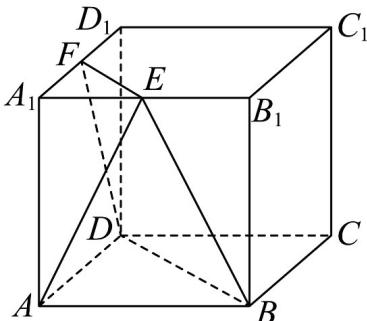

<!-- question-source:start -->
【变式1】在棱长为 $^{1}$ 的正方体 $ABCD-A_{1}B_{1}C_{1}D_{1}$ 中，E,F分别为 $A_{1}B_{1}$ ， $A_{1}D_{1}$ 的中点.

(1)求五面体 $ABD - A_{1}EF$ 的体积；

(2)若 $P$ 在线段 $A_{1}C_{1}$ 上， $CP //$ 平面 $BDEF$ ，求 $C_{1}P$ 的长度·
<!-- question-source:end -->

![[高中/课堂同步/题库/人教A版高中数学同步讲义(2026)/02_必修第二册/第八章 立体几何初步/讲义/专题8_5_空间直线_平面的平行_高效培优讲义_/题型06_由线面平行的性质求长度问题_sec_15/questions/answers/Q00065223A1.md]]
