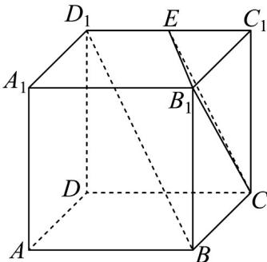

<!-- question-source:start -->
【变式2】如图，E 是棱长为 $^{2}$ 的正方体 $ABCD-A_{1}B_{1}C_{1}D_{1}$ 的棱 $C_{1}D_{1}$ 上一点，且 $BD_{1}//$ 面 $B_{1}CE$ ，则线段 CE 的

长度是\_\_\_\_。

<!-- question-source:end -->

![[高中/课堂同步/题库/人教A版高中数学同步讲义(2026)/02_必修第二册/第八章 立体几何初步/讲义/专题8_5_空间直线_平面的平行_高效培优讲义_/题型06_由线面平行的性质求长度问题_sec_15/questions/answers/Q00065224A1.md]]
