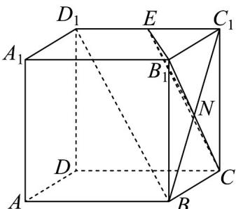

> [!faq]- 《专题8_5_空间直线_平面的平行_高效培优讲义_》官方解析
>
> > [!success]- **【答案】** $\sqrt{5}$
>
> > [!note]- **【分析】**
> > 连接 $BC_{1}$ 与 $B_{1}C$ 相交于点 $N$ ，则点 $N$ 是 $BC_{1}$ 的中点，利用线面平行的性质定理可得 $BD_{1} // EN$ ，即点
> >
> > $E_{是}C_{1}D_{1}$ 的中点，求出 CE 可得答案.
>
> > [!note]- **【解析】**
> > 连接 $BC_{1}$ 与 $B_{1}C$ 相交于点 $N$ ，连接 $EN$ ，则点 $N$ 是 $BC_{1}$ 的中点，
> >
> > 平面 $B_{1}CE \cap$ 平面 $BC_{1}D_{1} = EN$
> >
> > 因为 $BD_{1} / /$ 平面 $B_{1}CE$ ，所以 $BD_{1} / / EN$
> >
> > 可得点 E 是 $C_{1}D_{1}$ 的中点，
> >
> > 所以 $CE = \sqrt{CC_{1}^{2} + EC_{1}^{2}} = \sqrt{4 + 1} = \sqrt{5}$ ,
> >
> > 故答案为： $\sqrt{5}$
> >
> > 
