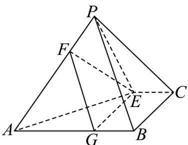

> [!faq]- 《专题8_5_空间直线_平面的平行_高效培优讲义_》官方解析
>
> > [!success]- **【答案】** B
>
> > [!note]- **【分析】**
> > 首先作辅助线，构造相似三角形，然后利用相似三角形的性质求得 $FA$ 的比值
> >
> > $$
> > \frac {P F}{F A}
> > $$
>
> > [!note]- **【解析】**
> > 过 E 作 $EG // BC$ 交 AB 于 G ，连接 FG ，如图所示
> >
> > 
> >
> > 因为 $EG \parallel BC$ ， $BC \subset$ 平面 PBC，EG 不在平面 PBC 上，
> >
> > 根据线面平行的判定定理可得 $EG / /$ 平面PBC.
> >
> > 又因为 $EF / /$ 平面 $PBC$ ， $EG\cap EF = E$ ， $EG,EF\subset$ 平面 $EFG$
> >
> > 根据平面与平面平行的判定定理的推论，可得平面 EFG // 平面 PBC
> >
> > 又平面 $PAB \cap$ 平面 EFG = FG ，平面 $PAB \cap$ 平面 PBC = PB ，所以 FG // PB .
> >
> > 根据相似三角形性质可得： $\frac{PF}{FA}=\frac{BG}{GA}$
> >
> > 因为 $EG // BC$ ， $CE // AB$ ，所以四边形 $BCEG$ 为平行四边形，所以 $CE = EG$ .
> >
> > 又 AB = 3CE ，所以 AG = 2BG ，所以 $\frac{PF}{FA} = \frac{BG}{GA} = \frac{1}{2}$
> >
> > 故选 **B**.
