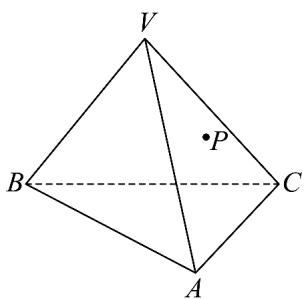
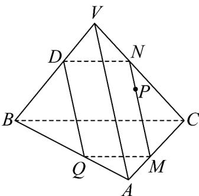

## 题型06 由线面平行的性质求长度问题

【典例1】如图，在正四面体木块 $V - ABC$ 中，点 $P$ 在 $\triangle YAC$ 内，过点 $P$ 将木块锯开，且使截面平行于直线

$VA \quad BC$ ，若截面的周长为 $^{4}$ ，则正四面体 $V-ABC$ 的表面积为（）

A. $4\sqrt{3}$ B. $3\sqrt{3}$ C. $4\sqrt{2}$ D. 2

【答案】A

【分析】作出示意图，由题意可求得 $2VA = 4$ ，进而求得正面体的棱长，根据正三角形面积公式求解正四面体

的表面积·

【详解】作出截面如图所示：

因为截面平行于直线 VA，BC，由线面平行的性质定理可得 $VA \parallel MN, DQ \parallel VA, ND \parallel BC, BC \parallel QM$ ，所以
DQ//MN, ND//QM

从而截面 MNDQ 是平行四边形，所以 $\frac{MN}{VA} = \frac{CN}{VC}, \frac{DN}{BC} = \frac{DN}{VC} = \frac{VN}{VC}$

所以 $\frac{CN}{VC} +\frac{VN}{VC} = 1$ ，又 $VA = VC$ ，所以 $MN + ND = VA$

又因为截面的周长为 $^{4}$ ，所以 2VA = 4，所以 VA = 2，

所以正四面体V-ABC的表面积为 $4\times S_{\triangle ABC}=4\times\frac{1}{2}\times2\times2\times\frac{\sqrt{3}}{2}=4\sqrt{3}$

故选：A

![[高中/课堂同步/题库/人教A版高中数学同步讲义(2026)/02_必修第二册/第八章 立体几何初步/讲义/专题8_5_空间直线_平面的平行_高效培优讲义_/题型06_由线面平行的性质求长度问题_sec_15/questions/Q00065223.md]]
![[高中/课堂同步/题库/人教A版高中数学同步讲义(2026)/02_必修第二册/第八章 立体几何初步/讲义/专题8_5_空间直线_平面的平行_高效培优讲义_/题型06_由线面平行的性质求长度问题_sec_15/questions/Q00065224.md]]
![[高中/课堂同步/题库/人教A版高中数学同步讲义(2026)/02_必修第二册/第八章 立体几何初步/讲义/专题8_5_空间直线_平面的平行_高效培优讲义_/题型06_由线面平行的性质求长度问题_sec_15/questions/Q00065225.md]]
