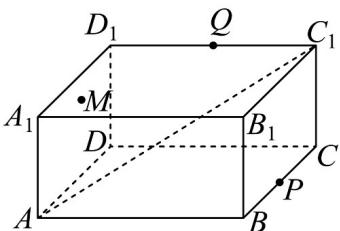

<!-- question-source:start -->
【变式1】如图，在长方体 $ABCD - A_{1}B_{1}C_{1}D_{1}$ 中， $AB = BC = 4$ ， $AA_{1} = 2$ ，点 $P$ ， $Q$ 分别为 $BC$ ， $C_1D_1$ 的中点，

点 M 为长方形 $ADD_{1}A_{1}$ 内一动点（含边界），若直线 $QM \parallel$ 平面 $APC_{1}$ ，则点 M 的轨迹长度为（）

A. 2 B. $\sqrt{5}$ C. $2\sqrt{2}$ D. $\sqrt{10}$
<!-- question-source:end -->

![[高中/课堂同步/题库/人教A版高中数学同步讲义(2026)/02_必修第二册/第八章 立体几何初步/讲义/专题8_5_空间直线_平面的平行_高效培优讲义_/题型07_平面与平面平行的判定_sec_16/questions/answers/Q00065226A1.md]]
