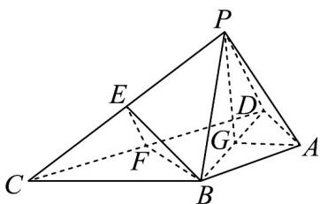

> [!faq]- 《专题8_5_空间直线_平面的平行_高效培优讲义_》官方解析
>
> > [!success]- **【答案】** (1)证明见解析 (2) $-\frac{1}{2}$
>
> > [!note]- **【分析】**
> > （1）要证明两平面平行，所以需要证明一平面内两条相交直线与另一平面平行，即证明 $EF / /$ 平面
> >
> > PDA 和 BF // 平面 PDA
> >
> > (2) 作辅助线确定二面角的平面角，然后根据余弦定理求出其余弦值.
>
> > [!note]- **【解析】**
> > （1）在 $\triangle PCD$ 中，点 $E, F$ 分别为 $PC, CD$ 的中点，
> >
> > 所以 $EF / / PD$ ，因为 $PD \subset$ 平面 $PDA$ ，而 $EF$ 不在平面 $PDA$ 内，
> >
> > 所以 EF // 平面 PDA·
> >
> > 因为 AB = AD, $\angle BAD = 120^{\circ}$ ，所以 $\angle BDA = 30^{\circ}$ .
> >
> > 因为 $\triangle BCD$ 为等边三角形，所以 $\angle BDC = 60^{\circ}$
> >
> > 所以 $\angle ADC = 90^{\circ}$ · 又 $BF \perp CD$ ，所以 $BF // AD$ ·
> >
> > 又因为 $AD \subset$ 平面 PDA，而 BF 不在平面 PDA 内，
> >
> > 所以 BF // 平面 PDA·
> >
> > 又 $EF \cap BF = F, EF, BF \subset$ 平面 BEF，
> >
> > 所以平面 BEF // 平面 PAD.
> >
> > (2) 取 BD 的中点为 G，连接 AG, PG.
> >
> > 因为 $AB = AD = PB = PD$ ，所以 $AG \perp BD, PG \perp BD$ .
> >
> > 因为 $AG \cap PG = G$ ，平面 $PBD \cap$ 平面 ABD = BD，
> >
> > 所以二面角 P-BD-A 的平面角为 $\angle PGA$ .
> >
> > 因为 $DG=\frac{1}{2}BD=\sqrt{3}$ ，所以 $AG=DG\times\frac{\sqrt{3}}{3}=1,AD=PD=\sqrt{1+3}=2$
> >
> > 所以 $PG = \sqrt{PD^{2} - DG^{2}} = 1$ .
> >
> > 根据余弦定理得 $\cos\angle PGA=\frac{PG^{2}+AG^{2}-PA^{2}}{2PG\times AG}=\frac{1+1-3}{2\times1\times1}=-\frac{1}{2}$
> >
> > 所以二面角 P-BD-A 的余弦值为 $-\frac{1}{2}$ .
> >
> > 
