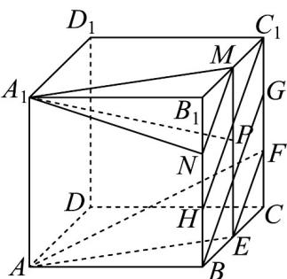
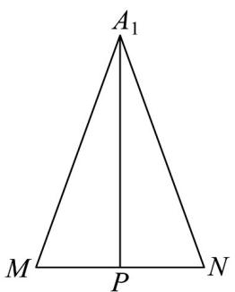

> [!faq]- 《专题8_5_空间直线_平面的平行_高效培优讲义_》官方解析
>
> > [!success]- **【答案】** C
>
> > [!note]- **【分析】**
> > 取 $B_{1}C_{1}$ 的中点M， $BB_{1}$ 上靠近点 $B_{1}C$ 的三等分点为N， $BB_{1}$ 上靠近点B的三等分点为H， $CC_{1}$ $C_{1}$ 上靠近点的三等分点为G，连接 $A_{1}M$ ， $A_{1}N$ ，MN，ME， $C_{1}H$ ，BG，ABCD- $A_{1}B_{1}C_{1}D$
> >
> > 中，易证平面 $A_{1}MN//$ 平面 $AEF\cdot$ 又 $PA_{1}//$ 平面 $AEF$ ，动点 $P$ 在正方形 $BCC_{1}B_{1}$ （包括边界）内运动，可确定点 $P_{\text{在线段}}MN_{\text{上运动}} \triangle A_{1}MN_{\text{中，利用三角形知识即可求解线段}} PA_{1}$ 的长度的最小值·
>
> > [!note]- **【解析】**
> > 
> >
> > 取 $B_{1}C_{1}$ 的中点 $M$ ， $BB_{1}$ 上靠近点 $B_{1}$ 的三等分点为 $N$ ， $BB_{1}$ 上靠近点 $B$ 的三等分点为 $H$ ， $CC_{1}$ 上靠近点 $C_{1}$ 的三等分点为 $G$ ，连接 $A_{1}M$ ， $A_{1}N$ ， $MN$ ， $ME$ ， $C_{1}H$ ， $BG$ ，如图所示。在正四棱柱 $ABCD - A_{1}B_{1}C_{1}D$ 中，
> >
> > $AA_{1}//BB_{1}//ME$ 且 $AA_{1}=BB_{1}=ME$
> >
> > ∴四边形 $AA_{1}ME$ 是平行四边形，∴ $A_{1}M // AE$ .
> >
> > 又 $A_{1}M \ddot{E}$ 平面 AEF， $AE \subset$ 平面 AEF，∴ $A_{1}M \parallel$ 平面 AEF.
> >
> > ∵M，N分别是 $B_{1}C_{1}$ 和 $B_{1}H$ 的中点，∴ $MN//C_{1}H$ .
> >
> > 同理可知 $EF//BG$ ，
> >
> > 又 $BH//C_{1}G,BH=C_{1}G$
> >
> > ∴四边形 $BGC_{1}H$ 是平行四边形，∴ $BG//C_{1}H$
> >
> > ∴ EF//MN.
> >
> > 又 $MN \not\subset$ 平面 AEF ， $EF \subset$ 平面 AEF ，∴ $MN \parallel$ 平面 AEF ·
> >
> > 又 $A_{1}M \cap MN = M$ ， $A_{1}M \subset$ 平面 $A_{1}MN$ ， $MN \subset$ 平面 $A_{1}MN$
> >
> > ∴平面 $A_{1}MN//$ 平面 AEF·
> >
> > $\because PA_{1} //$ 平面 AEF ，动点 P 在矩形 $BCC_{1}B_{1}$ （包括边界）内运动，
> >
> > ∴点 P 在线段 MN 上运动·
> >
> > 在 $\triangle A_{1}MN$ 中，易求 $A_{1}M = A_{1}N = \sqrt{5}$ ， $MN = \sqrt{2}$ ， $\triangle A_{1}MN$ 为等腰三角形，
> >
> > ∴点 P 为线段 MN 的中点时， $PA_{1}$ 取得最小值·
> >
> > 
> >
> > 此时 $PA_{1}=\sqrt{A_{1}M^{2}-PM^{2}}=\sqrt{5-\left(\frac{\sqrt{2}}{2}\right)^{2}}=\sqrt{\frac{9}{2}}=\frac{3\sqrt{2}}{2}$ ，即 $PA_{1}$ 的最小值为 $\frac{3\sqrt{2}}{2}$ .
> >
> > 故选 **C**.
