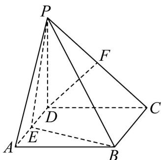

<!-- question-source:start -->
【变式3】如图，在四棱锥 $P - ABCD$ 中，底面 $ABCD$ 为正方形，点 $E,F$ 分别为 $AD,PC$ 的中点.

(1)证明： $DF / /$ 平面PBE；

(2)在棱 $BC$ 上是否存在点 $G$ ，使得平面 $DFG / /$ 平面 $PBE$ ？若存在，求出 $GC$ 的值；若不存在，说明理由.

$$
\frac {B G}{G C}
$$
<!-- question-source:end -->

![[高中/课堂同步/题库/人教A版高中数学同步讲义(2026)/02_必修第二册/第八章 立体几何初步/讲义/专题8_5_空间直线_平面的平行_高效培优讲义_/题型08_补全平面与平面平行的条件_sec_17/questions/answers/Q00065231A1.md]]
