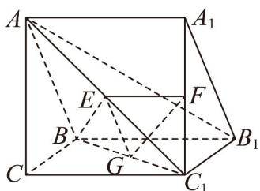

> [!faq]- 《专题8_5_空间直线_平面的平行_高效培优讲义_》官方解析
>
> > [!success]- **【答案】** (1)证明见解析 (2) 存在点 G，满足 $BG = \lambda BC_{1}$ 即可，理由见解析
>
> > [!note]- **【分析】**
> > （1）由平行线分线段成比例定理推得 $EF // AA_{1}$ ，利用三棱柱的性质易得 $EF // BB_{1}$ ，即可由线线平
> >
> > 行证得线面平行；
> >
> > (2) 线段 $BC_{1}$ 上存在点 G，满足 $BG = \lambda BC_{1}$ ，即可由线线平行推得线面平行再证明面面平行即可.
>
> > [!note]- **【解析】**
> > （1）因 $\overline{AE} = \lambda \overline{AC_{1}}$ ， $\overline{A_{1}F} = \lambda \overline{A_{1}C_{1}}$ ，则 $\frac{AE}{AC_{1}} = \frac{A_{1}F}{A_{1}C_{1}}$ ，故 $EF // AA_{1}$
> >
> > 在三棱柱 $ABC-A_{1}B_{1}C_{1}$ 中， $AA_{1}//BB_{1}$ ，则 $EF//BB_{1}$ ，
> >
> > 因 $EF \not\subset$ 平面 $BCC_{1}B_{1}$ ， $BB_{1} \subset$ 平面 $BCC_{1}B_{1}$ ，则 $EF \parallel$ 平面 $BCC_{1}B_{1}$ .
> >
> > (2)
> >
> > 
> >
> > 如图，线段 $BC_{1}$ 上存在点 $G$ ，满足 $\overline{BG} = \lambda \overline{BC}_{1}$ ，即可使平面 $EFG / /$ 平面 $ABB_{1}A_{1}$ ，理由如下：
> >
> > 因 $\overline{AE} = \lambda \overline{AC_{1}}$ ，则 $\frac{AE}{AC_{1}} = \frac{BG}{BC_{1}}$ ，则 $EG // AB$ ，因 $AB \subset$ 平面 $ABB_{1}A_{1}$ ， $EG \not\subset$ 平面 $ABB_{1}A_{1}$ ，故 $EG //$ 平面
> >
> > $ABB_{1}A_{1}$
> >
> > 由（1） $EF // AA_{1}$ ，因 $AA_{1} \subset$ 平面 $ABB_{1}A_{1}$ ， $EF \not\subset$ 平面 $ABB_{1}A_{1}$ ，故 $EF //$ 平面 $ABB_{1}A_{1}$
> >
> > 又 $EG \cap EF = E, EG, EF \subset$ 平面 $EFG$ ，故平面 $EFG //$ 平面 $ABB_{1}A_{1}$ .
