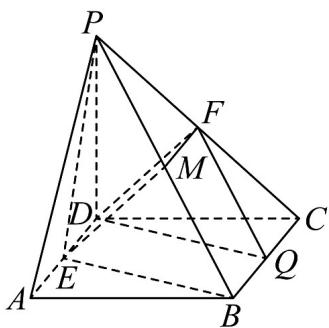

> [!faq]- 《专题8_5_空间直线_平面的平行_高效培优讲义_》官方解析
>
> > [!success]- **【答案】** (1)证明见解析 (2) 存在； $\frac{BG}{GC} = 1$
>
> > [!note]- **【分析】**
> > （1）取 $PB$ 的中点 $M$ ，连接 $EM, FM$ ，由题意可证得 $MF // DE$ 且 $MF = DE$ ，即证得四边形 $DEMF$
> >
> > 为平行四边形，再证得结论；
> >
> > (2) 取 BC 的中点 Q，连接 $FQ, DQ$ ，由题意可证得平面 $DFQ //$ 平面 PBE，由题意可证得 G, Q 重合，再求
> >
> > 出 $\frac{BG}{GC}$ 的值.
>
> > [!note]- **【解析】**
> > （1）证明：取 $PB$ 的中点 $M$ ，连接 $EM, FM$
> >
> > ∵ 在四棱锥 $P-ABCD$ 中，底面 ABCD 为正方形，E，F 分别为 AD，PC 的中点，
> >
> > ∴ MF // BC，且 $MF = \frac{1}{2} BC, DE // BC, DE = \frac{1}{2} BC$
> >
> > $\therefore MF / / DE$ ，且 $MF = DE$
> >
> > ∴ 四边形 DEMF 为平行四边形，DF // EM
> >
> > 而 $DF \not\subset$ 平面 PBE, EM ⊂ 平面 PBE,
> >
> > $\therefore DF //$ 平面 PBE ;
> >
> > (2) 存在满足条件的 G，且 $\frac{BG}{GC}=1$
> >
> > 证明如下：取 $BC$ 的中点 $Q$ ，连接 $FQ, DQ$ ，则 $FQ // PB$
> >
> > 由 $FQ \not\subset$ 平面 $PBE, PB \subset$ 平面 $PBE, \therefore FQ //$ 平面 PEB
> >
> > 又∵ $DF \cap FQ = Q, \therefore$ 平面 $DFQ //$ 平面 PBE
> >
> > 又∵ 平面 DFG // 平面 PBE, ∴ G 与 Q 重合，
> >
> > 即 $G$ 为 $BC$ 的中点， $\therefore \frac{BG}{GC} = 1$
> >
> > 
