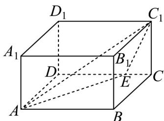

<!-- question-source:start -->
【变式2】如图，在长方体 $ABCD - A_{1}B_{1}C_{1}D_{1}$ 中， $AB = 3$ ， $AD = 2$ ， $AA_{1} = 1$ ， $E$ 是棱 $CD$ 上的一个动点，下列

命题正确的是（）

A. 长方体外接球的表面积为 $14\pi$

B．过 A, E, $C_{1}$ 三点的平面截长方体 $ABCD - A_{1}B_{1}C_{1}D_{1}$ 所得截面的周长的最小值为 $6\sqrt{2}$

C. 在棱 $DD_{1}$ 上存在相应的点 $G$ ，使得 $A_{1}G//$ 平面 $AEC_{1}$

D．若 $CE=\frac{1}{3}CD$ ，点 F 在四边形 $A_{1}B_{1}C_{1}D_{1}$ （包括边界）上运动，且 $DF//$ 平面 $AEC_{1}$ ，则 DF 的最小值为

$$
\frac {\sqrt {6}}{2}
$$
<!-- question-source:end -->

![[高中/课堂同步/题库/人教A版高中数学同步讲义(2026)/02_必修第二册/第八章 立体几何初步/讲义/专题8_5_空间直线_平面的平行_高效培优讲义_/题型09_空间平行的转化_sec_18/questions/answers/Q00065236A1.md]]
