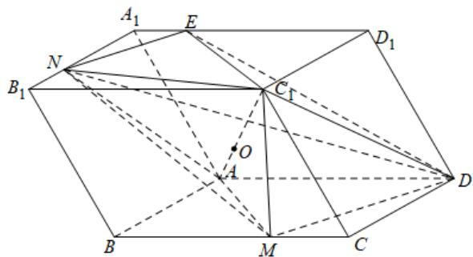

> [!faq]- 《专题8_5_空间直线_平面的平行_高效培优讲义_》官方解析
>
> > [!success]- **【答案】** D
>
> > [!note]- **【分析】**
> > 根据等体积法得 $\frac{AO}{OC_{1}}=\frac{V_{A-MND}}{V_{C_{1}-MND}}=\frac{V_{N-AMD}}{V_{C_{1}-MND}}$ ，计算可得 $V_{N-AMD}=\frac{1}{6}V$ ， $V_{C_{1}-MND}=\frac{5}{27}V$ ，代入化简即可·
>
> > [!note]- **【解析】**
> > 设平行六面体的体积为 $V$
> >
> > 因为平行六面体的上下底面平行，所以平面 $DMN$ 与上下底面的交线互相平行，
> >
> > 设 $NE$ 为平面 $DMN$ 与上底面的交线， $E$ 为与 $A_{1}D_{1}$ 的交点，则 $NE // MD$
> >
> > 连接 DE, AM, AN, $C_{1}N$ , $C_{1}M$ , $C_{1}D$ , $C_{1}E$ ,
> >
> > 由等体积法可得 $\frac{AO}{OC_{1}}=\frac{V_{A-MND}}{V_{C_{1}-MND}}=\frac{V_{N-AMD}}{V_{C_{1}-MND}}$
> >
> > 设平行六面体的上下底面的距离为 d， $V_{N-AMD}=\frac{1}{3}S_{\triangle AMD}\cdot d=\frac{1}{3}\times\frac{1}{2}\times S_{\square ABCD}\cdot d=\frac{1}{6}V$ ，
> >
> > 因为在平行六面体 $ABCD - A_{1}B_{1}C_{1}D_{1}$ 中
> >
> > 因为 $A_{1}N // DC, A_{1}E // MC, NE // DM$
> >
> > 由等角定理可知 $\triangle A_{1}NE, \triangle DCM$ 各内角相等，所以 $\triangle A_{1}NE \sim \triangle DCM$
> >
> > 所以 $\frac{NE}{MD} = \frac{A_1N}{DC} = \frac{2}{3}$ ， $A_{1}E = \frac{2}{3} CM = \frac{2}{3}\times \frac{1}{3} BC = \frac{2}{9} BC = \frac{2}{9} A_{1}D_{1}$
> >
> > 又因为 $\square A_{1}B_{1}C_{1}D_{1}$ 各内角相等或互补，
> >
> > 所以 $\sin\angle B_{1}A_{1}D_{1}=\sin\angle A_{1}B_{1}D_{1}=\sin\angle B_{1}C_{1}D_{1}=\sin\angle C_{1}D_{1}A_{1}$
> >
> > 所以 $V_{C_{1}-MND}=\frac{3}{2}V_{C_{1}-NED}=\frac{3}{2}V_{D-NEC_{1}}=\frac{3}{2}\times\frac{1}{3}\times S_{\triangle NEC_{1}}\cdot d$
> >
> > 因为 $S_{\square A_{1}B_{1}C_{1}D_{1}} = A_{1}B_{1} \cdot A_{1}D_{1} \cdot \sin \angle B_{1}A_{1}D_{1} = S_{\square ABCD}$ ,
> >
> > $$
> > S _ {\triangle A _ {1} N E} = \frac {1}{2} \times \frac {2}{3} A _ {1} B _ {1} \times \frac {2}{9} A _ {1} D _ {1} \sin \angle B _ {1} A _ {1} D _ {1} = \frac {2}{2 7} S _ {\square A B C D},
> > $$
> >
> > $$
> > S _ {\triangle E D _ {1} C _ {1}} = \frac {1}{2} \times A _ {1} B _ {1} \times \frac {7}{9} A _ {1} D _ {1} \sin \angle B _ {1} A _ {1} D _ {1} = \frac {7}{1 8} S _ {\square A B C D},
> > $$
> >
> > $$
> > S _ {\triangle C _ {1} B _ {1} N} = \frac {1}{2} \times \frac {1}{3} A _ {1} B _ {1} \times A _ {1} D _ {1} \sin \angle B _ {1} A _ {1} D _ {1} = \frac {1}{6} S _ {\square A B C D}
> > $$
> >
> > $S_{\triangle NEC_{1}} = S_{\square A_{1}B_{1}C_{1}D_{1}} - \left(S_{\triangle A_{1}NE} + S_{\triangle ED_{1}C_{1}} + S_{\triangle C_{1}B_{1}N}\right) = \frac{10}{27}S_{\square ABCD}$ ，所以
> >
> > 所以 $V_{C_{1}-MND}=\frac{5}{27}V$ ，即 $\frac{AO}{OC_{1}}=\frac{\frac{1}{6}V}{\frac{5}{27}V}=\frac{9}{10}$ .
> >
> > 
> >
> > 故选 **D**.
