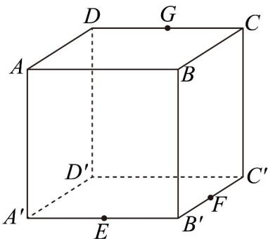
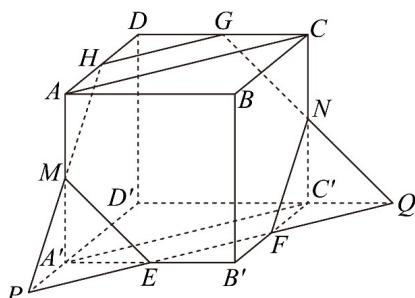

> [!faq]- 《专题8_5_空间直线_平面的平行_高效培优讲义_》官方解析
>
> > [!success]- **【答案】**  A. $\sqrt{10}$ B. 3 C. $\frac{3\sqrt{6}}{2}$ D. $\frac{\sqrt{38}}{2}$
>
> > [!note]- **【分析】**
> > 在 $B_{1}B, B_{1}C_{1}$ 上取点 $E, F$ ，使得 $BB_{1} = 3EB_{1}, B_{1}C_{1} = 3B_{1}F$ ，证得平面 $A_{1}EF // \text{平面 } C_{1}MN$ ，得到点 $Q$ 的轨迹为线段 $EF$ ，在等腰三角形 $A_{1}EF$ 中，求得底边 $EF$ 上的高，即可求解·
>
> > [!note]- **【解析】**
> > 在 $B_{1}B, B_{1}C_{1}$ 上取点 E, F ，使得 $BB_{1} = 3EB_{1}, B_{1}C_{1} = 3B_{1}F$
> >
> > 分别连结 $EF, BC_{1}, AD_{1}$
> >
> > 因为 $A_{1}D_{1}=3D_{1}N$ ，可得 $A_{1}N//C_{1}F$ ，且 $A_{1}N=C_{1}F$ ，
> >
> > 所以四边形 $A_{1}FC_{1}N$ 为平行四边形，所以 $C_{1}N // A_{1}F$
> >
> > 由 $BB_{1} = 3EB_{1}$ 且 $B_{1}C_{1} = 3B_{1}F$ ，可得 $EF / / BC_{1}$
> >
> > 又由 $AA_{1} = 3AM$ 且 $A_{1}D_{1} = 3D_{1}N$ ，所以 $MN / / AD_{1}$
> >
> > 在正方体 $ABCD-A_{1}B_{1}C_{1}D_{1}$ 中，可得 $AD_{1}//BC_{1}$ ，所以 EF//MN
> >
> > 因为 $A_{1}F \notin$ 平面 $C_{1}MN$ ，且 $C_{1}N \subset$ 平面 $C_{1}MN$ ，所以 $A_{1}F //$ 平面 $C_{1}MN$ ，
> >
> > 同理可证 EF // 平面 $C_{1}MN$
> >
> > 又因为 $A_{1}F \cap EF = F$ ，且 $A_{1}F, EF \subset$ 平面 $A_{1}EF$ ，所以平面 $A_{1}EF //$ 平面 $C_{1}MN$ ，
> >
> > 因此点Q的轨迹为线段EF，
> >
> > 在等腰三角形 $A_{1}EF$ 中， $A_{1}F = A_{1}E = \sqrt{10}, EF = \sqrt{2}$
> >
> > 可得底边 $EF$ 上的高为 $\sqrt{A_1F^2 - (\frac{EF}{2})^2} = \frac{\sqrt{38}}{2}$ ，此即为 $A_1Q$ 长度的最小值·故选：D.
> >
> > 
> >
> > 题型10 由面面平行证明线面平行、线线平行、面面平行【典例1】如图，在棱长为 $\sqrt{2}$ 的正方体 $ABCD - A'B'C'D'$ 中，点 $E$ 、 $F$ 、 $G$ 分别是棱 $A'B'$ 、 $B'C'$ 、 $CD$ 的中点，则由点 $E$ 、 $F$ 、 $G$ 确定的平面截正方体所得的截面多边形的面积等于（）
> >
> > 
> >
> > A. $\frac{3\sqrt{3}}{2}$ B. $2\sqrt{3}$ C. $\frac{5\sqrt{3}}{2}$ D. $\frac{3\sqrt{2}}{2}$
> >
> > 【答案】A
> >
> > 【分析】根据给定条件，借助面面平行性质作出截面，进而求出截面面积·
> > 【详解】因为在棱长为 $\sqrt{2}$ 的正方体 $ABCD - A'B'C'D'$ 中，由 E、F 分别为 $A'B'$ 、 $B'C'$ 的中点，
> > 得 $EF // A'C'$ ，且 EF = 1，由 $AA' // CC'$ 且 $AA' = CC'$ ，得四边形 $AA'C'C$ 为平行四边形，
> > 即 $AC // A'C' // EF$ ，设平面 EFG 交棱 AD 于点 H，由平面 ABCD // 平面 $A'B'C'D'$ 且平面 $EFG \cap$ 平面 $A'B'C'D' = EF$ ，平面 $EFG \cap$ 平面 ABCD = GH，得 $GH // EF // AC$ 由 G 为 CD 的中点，得 H 为 AD 的中点，设直线 EF 分别交 $D'A'$ 、 $D'C'$ 的延长线于点 P、Q，如连接 PH 交棱 $AA'$ 于点 M ，连接 $QG$ 交棱 $CC'$ 于点 N ，连接 EM 、 FN ，则截面为六边形 EFNGHM ·
> >
> > 
> >
> > 由 $A^{\prime}P / / C^{\prime}B^{\prime}$ ， $E$ 为 $A'B'$ 的中点，得 $A'P = B'F = \frac{\sqrt{2}}{2} = AH$ ，又 $AH / / A'P$ ，则 $M$ 为 $AA'$ 的中点，
> >
> > 同理 $N$ 为 $CC'$ 的中点，六边形 $EFNGHM$ 是边长为 $^1$ 的正六边形，
> >
> > 所以 EFNGHM 截面面积为 $6 \times \frac{1}{2} \times 1^{2} \times \sin 60^{\circ} = 6 \times \frac{\sqrt{3}}{4} = \frac{3\sqrt{3}}{2}$
> >
> > 故选 **A**
