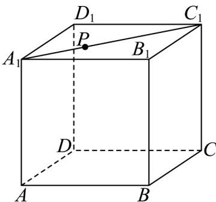
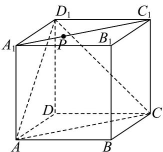
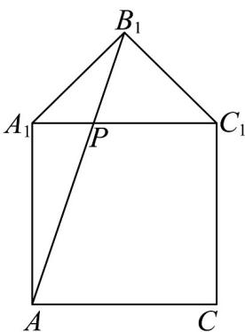
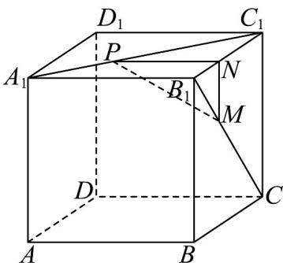

> [!faq]- 《专题8_5_空间直线_平面的平行_高效培优讲义_》官方解析
>
> > [!success]- **【答案】** ( )  A. $A_{1}C_{1} / /$ 平面 $ACD_{1}$ B．存在点 P，使得直线 AC 与 BP 共面 C. $PB_{1} + PA$ 的最小值为 $\sqrt{2 + \sqrt{2}}$ D．若 M 为线段 $B_{1}C$ 上的动点，且 $MP \parallel$ 平面 $ABB_{1}A_{1}$ ．则 MP 的最小值为 $\frac{\sqrt{2}}{2}$
>
> > [!note]- **【分析】**
> > 利用正方体性质可知 $A_{1}C_{1}//AC$ ，再由线面平行定理可证明 $^{A}$ 正确，利用反证法假设存在点 P，使得
> >
> > 直线 AC 与 BP 共面，可得出结论与平面 ABC // 平面 $A_{1}B_{1}C_{1}$ 矛盾，因此 B 错误；以 $A_{1}C_{1}$ 为旋转轴，将 $\triangle A_{1}B_{1}C_{1}$
> >
> > 旋转到与平面 $AA_{1}C_{1}C$ 共面，易知 $PB_{1} + PA \quad AB_{1}$ ，再由余弦定理计算可得 $^{C}$ 正确，根据面面平行判定定理可
> >
> > 证得平面 $MNP //$ 平面 $ABB_{1}A_{1}$ ，再由其性质可得 $MP //$ 平面 $ABB_{1}A_{1}$ ，设 $NC_{1} = x$ ，利用三角形相似以及二次函
> >
> > 数性质可判断 $^{D}$ 正确·
>
> > [!note]- **【解析】**
> > 对于 $A$ ，如下图所示：
> >
> > 
> >
> > 由正方体性质可知 $A_{1}C_{1} / / AC$
> >
> > 又 $A_{1}C_{1} \notin$ 平面 $ACD_{1}$ ， $AC \subset$ 平面 $ACD_{1}$ ，所以 $A_{1}C_{1} //$ 平面 $ACD_{1}$ ，即 A 正确；
> >
> > 对于 B，假设存在点 P，使得直线 AC 与 BP 共面，
> >
> > 显然 A, B, C 三点共面，若直线 AC 与 BP 共面，则可知点 P 在平面 ABC 内，
> >
> > 又 P 为线段 $A_{1}C_{1}$ 上的动点，即 P 在平面 $A_{1}B_{1}C_{1}$ 内，
> >
> > 因此可知点 P 在平面 ABC 与平面 $A_{1}B_{1}C_{1}$ 的交线上，显然这与平面 ABC // 平面 $A_{1}B_{1}C_{1}$ 矛盾，因此 B 错误；
> >
> > 对于 C，以 $A_{1}C_{1}$ 为旋转轴，将 $\triangle A_{1}B_{1}C_{1}$ 旋转到与平面 $AA_{1}C_{1}C$ 共面，如下图所示：
> >
> > 
> >
> > 易知 $PB_{1} + PA \quad AB_{1}$ ，若要使 $PB_{1} + PA$ 取得最小值，只需连接 $AB_{1}$ 交 $A_{1}C_{1}$ 于点 $P$
> >
> > 因此为 $AA_{1} = AB_{1} = 1$ ，且 $\angle AA_{1}C_{1} = 90^{\circ},\angle C_{1}A_{1}B_{1} = 45^{\circ}$
> >
> > 在 $\triangle AA_{1}B_{1}$ 中， $\angle AA_{1}B_{1} = 135^{\circ}$ ，所以 $AB_{1}^{2} = AA_{1}^{2} + A_{1}B_{1}^{2} - 2AA_{1} \cdot A_{1}B_{1}\cos 135^{\circ} = 1 + 1 + \sqrt{2} = 2 + \sqrt{2}$
> >
> > 即 $PB_{1} + PA \quad AB_{1} = \sqrt{2 + \sqrt{2}}$ ，所以 $PB_{1} + PA$ 的最小值为 $\sqrt{2 + \sqrt{2}}$ ，可得 $C$ 正确；
> >
> > 对于 D，过点 P 作 $PN // A_{1}B_{1}$ 交 $B_{1}C_{1}$ 于点 N，过点 N 作 $MN // BB_{1}$ 交 $B_{1}C$ 于点 M，连接 MP，如下图所示：
> >
> > 
> >
> > 因为 $PN // A_1B_1$ ， $PN \notin$ 平面 $ABB_1A_1$ ， $A_1B_1 \subset$ 平面 $ABB_1A_1$ ，所以 $PN //$ 平面 $ABB_1A_1$ ；
> >
> > 又 $MN \parallel BB_{1}$ ， $PN \notin$ 平面 $ABB_{1}A_{1}$ ， $BB_{1} \subset$ 平面 $ABB_{1}A_{1}$ ，所以 $MN \parallel$ 平面 $ABB_{1}A_{1}$ ；
> >
> > 又 $MN \cap PN = N$ ， $MN, PN \subset$ 平面 $MNP$
> >
> > 所以平面 $MNP \parallel$ 平面 $ABB_{1}A_{1}$
> >
> > 又 $MP \subset$ 平面 MNP ，所以 $MP \parallel$ 平面 $ABB_{1}A_{1}$ ；
> >
> > 设 $NC_{1}=x$ ，则 PN=x, $B_{1}N=1-x$
> >
> > 显然 $MN = B_{1}N = 1 - x$
> >
> > $$
> > M P = \sqrt {M N ^ {2} + P N ^ {2}} = \sqrt {(1 - x) ^ {2} + x ^ {2}} = \sqrt {2 x ^ {2} - 2 x + 1} = \sqrt {2 \left(x - \frac {1}{2}\right) ^ {2} + \frac {1}{2}} \quad \sqrt {\frac {1}{2}} = \frac {\sqrt {2}}{2}
> > $$
> >
> > 所以当 $NC_{1} = \frac{1}{2}$ 时，即 $B_{1}M = \frac{\sqrt{2}}{2}$ 时， $MP$ 取最小值，最小值为 $\frac{\sqrt{2}}{2}$ ，所以D正确·
> >
> > 故选 **ACD**
