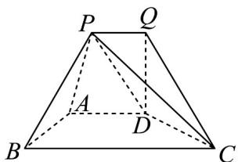
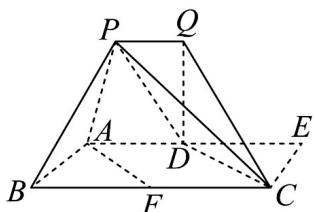
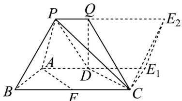

> [!faq]- 《专题8_5_空间直线_平面的平行_高效培优讲义_》官方解析
>
> > [!success]- **【答案】** 正三角形，四边形 $ADQP$ 为直角梯形， $\angle ADQ = \angle DQP = 90^{\circ}$ ， $AB = AD = 2$ ， $E$ 为平面 $ADQP$ 上的点。  (1)当点 E 在直线 AD 上时，求线段 AE 的长度，使得 CE || 平面 PAB； (2)若 $CE$ ||平面 $PAB$ ，求线段 $CE$ 的最小值.
>
> > [!note]- **【分析】**
> > （1）由 $CE$ 平面 $PAB$ ，利用线面平行的性质得到 $CE$ AB，证得 $AE = BC$ ，再在等腰梯形ABCD
> >
> > 中利用题设中条件求 BC 即可；
> >
> > (2) 过点 C 作 $CE_{1} \parallel AB$ 交 AD 的延长线于点 $E_{1}$ ，过点 $E_{1}$ 作 $E_{1}E_{2} \parallel PA$ ，交 PQ 的延长线于点 $E_{2}$ ，得到平面
> >
> > $CE_{1}E_{2}$ ||平面 PAB·记 E 为直线 $E_{1}E_{2}$ 上任意一点，由面面平行的性质得到 CE ||平面 PAB，线段 CE 的最小值为
> >
> > 点 C 到 $E_{1}E_{2}$ 的距离·再通过证明 $\triangle CE_{1}E_{2} \cong \triangle PAB$ ，得到 $\triangle CE_{1}E_{2}$ 是以 2 为边长的等边三角形，求 $E_{1}E_{2}$ 边上的
> >
> > 高即得 CE 的最小值·
>
> > [!note]- **【解析】**
> > （1）因为 $CE$ 平面 $PAB$ ， $CE \subset$ 平面 $ABCD$ ，平面 $ABCD \cap$ 平面 $PAB = AB$
> >
> > 所以 $CE \parallel AB$ .
> >
> > 又因为四边形 ABCD 为等腰梯形， $AD \parallel BC$ ，
> >
> > 所以四边形 $ABCE$ 为平行四边形，因此 $AE = BC$
> >
> > 在 BC 上找一点 F ，使得 AB = BF = 2 .
> >
> > 
> >
> > 因为 $\angle ABF = 60^{\circ}$ ，所以 $\triangle ABF$ 为等边三角形，
> >
> > 因此 $\angle AFB = 60^{\circ}$
> >
> > 又因为在等腰梯形 $ABCD$ 中， $\angle DCB = \angle ABC = 60^{\circ}$ ，所以 $\angle AFB = \angle DCB$ 。
> >
> > 所以 $AF \parallel CD$ .
> >
> > 又因为 $AD \parallel FC$ ，所以四边形 AFCD 为平行四边形，
> >
> > 因此 $FC = AD = 2$ ，所以 $AE = BC = BF + FC = 4$
> >
> > (2) 过点 C 作 $CE_{1} \parallel AB$ 交 AD 的延长线于点 $E_{1}$ ，过点 $E_{1}$ 作 $E_{1}E_{2} \parallel PA$ ，交 PQ 的延长线于点 $E_{2}$ ，
> >
> > 
> >
> > $\because CE_{1} \parallel PA, PA \subset \text{平面 } PAB, CE_{1} \not\subset \text{ 平面 } PAB, \therefore CE_{1} \parallel \text{ 平面 } PAB,$
> >
> > 同理 $E_{1}E_{2}$ ||平面PAB，
> >
> > 又因为 $CE_{1} \cap E_{1}E_{2} = E_{1}, CE_{1}, E_{1}E_{2} \subset$ 平面 $CE_{1}E_{2}$
> >
> > 所以平面 $CE_{1}E_{2}\parallel$ 平面 $PAB\cdot$
> >
> > 直线 $E_{1}E_{2}$ 上任意一点记为 $E$ ，则 $CE\subset$ 平面 $CE_{1}E_{2}$ ，所以 $CE\| \text{平面}PAB$ ：
> >
> > 所以线段 $CE$ 的最小值为点 $C$ 到 $E_{1}E_{2}$ 的距离，即 $\triangle CE_{1}E_{2}$ 中以 $C$ 为顶点的高.
> >
> > 因为 $PE_{2}\parallel AD\parallel BC$ ，所以四边形 $E_{1}E_{2}PA$ ，四边形 $ABCE_{1}$ 为平行四边形，
> >
> > 所以 $PE_{2}=AE_{1}=BC, PBCE_{2}$ 为平行四边形，
> >
> > 所以 $\triangle CE_{1}E_{2}\cong\triangle PAB$
> >
> > 所以 $\triangle CE_{1}E_{2}$ 是以 $^2$ 为边长的等边三角形，则高为 $\sqrt{3}$
> >
> > 因此线段 $CE$ 的最小值为 $\sqrt{3}$
