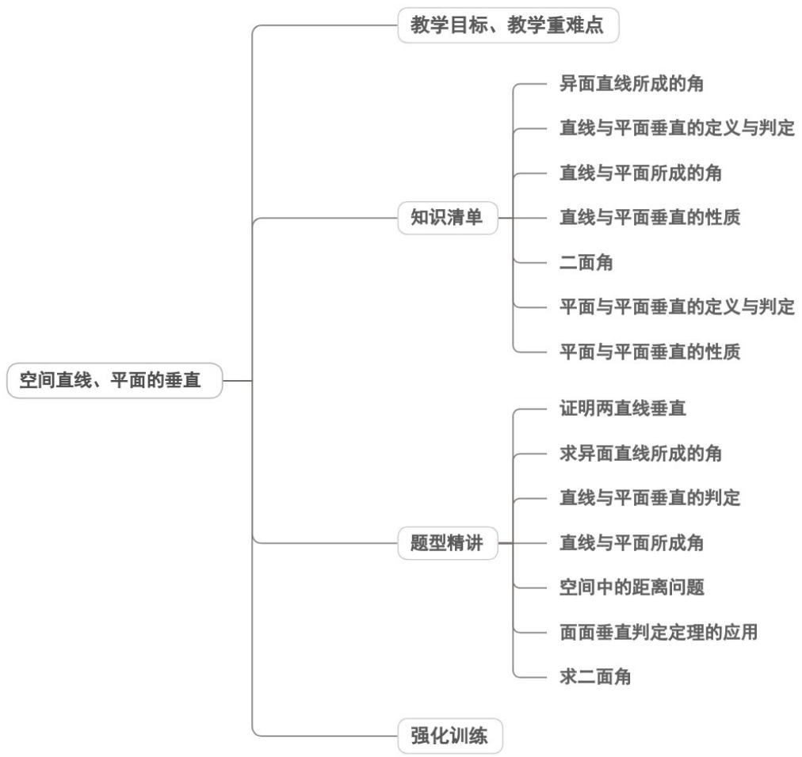

## 专题8.6 空间直线、平面的垂直

## 教学目标、教学重难点

<table><tr><td>教学目标</td><td>1.掌握空间中直线与直线垂直的定义(含异面直线垂直的判定:所成角为 $90^{\circ}$ ),能准确求解异面直线所成角的大小(取值范围 $0^{\circ}<\theta\leq90^{\circ}$ )。2.理解直线与平面垂直的定义(直线垂直于平面内任意一条直线),熟练掌握线面垂直的判定定理(一条直线与平面内两条相交直线都垂直,则直线与平面垂直)及性质定理(垂直于同一平面的两条直线平行)。3.明确平面与平面垂直的定义(两平面所成二面角为直二面角),掌握面面垂直的判定定理(一个平面过另一个平面的垂线,则两平面垂直)与性质定理(两平面垂直,一个平面内垂直于交线的直线垂直于另一个平面)。</td></tr><tr><td>教学重难点</td><td>1.重点三大判定定理的探究与应用:线面垂直判定定理的条件(“两条相交直线”的关键作用)、面面垂直判定定理的“线面垂直推面面垂直”逻辑,以及定理在证明中的灵活运用。2.难点判定定理的探究过程:线面垂直判定定理中“用两条相交直线代替无数条直线”的“有限代替无限”思想,学生难以自主突破思维障碍;面面垂直判定定理的发现过程(如何从线面垂直自然过渡到面面垂直)。</td></tr></table>
