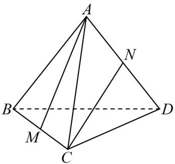

<!-- question-source:start -->
1. 如图，在正四面体 $A - BCD$ 中， $M, N$ 分别是 $BC$ 与 $AD$ 的中点，设 $AM$ 和 $CN$ 所成角为 $\alpha$ ，则 $\cos \alpha$ 的值

为（）

A. $\frac{2}{3}$ B. $\frac{1}{3}$ C. $\frac{3}{4}$ D. $\frac{1}{4}$
<!-- question-source:end -->

![[高中/课堂同步/题库/人教A版高中数学同步讲义(2026)/02_必修第二册/第八章 立体几何初步/讲义/专题8_6_空间直线_平面的垂直_高效培优讲义_/即学即练_sec_04/questions/answers/Q00065248A1.md]]
