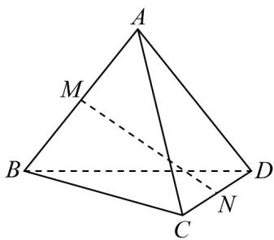

<!-- question-source:start -->
1．如图，四面体ABCD中，AC=3，BD=2，M,N分别为AB,CD的中点·若异面直线AC与BD所成角的大
小为 $60^{\circ}$ ，则MN的长为（）

A. $\frac{\sqrt{21}}{2}$ B. $\frac{\sqrt{13}}{2}$ C. $\frac{\sqrt{19}}{2}$ D. $\frac{\sqrt{7}}{2}$
<!-- question-source:end -->

![[高中/课堂同步/题库/人教A版高中数学同步讲义(2026)/02_必修第二册/第八章 立体几何初步/讲义/专题8_6_空间直线_平面的垂直_高效培优讲义_/强化训练_sec_18/questions/answers/Q00065271A1.md]]
