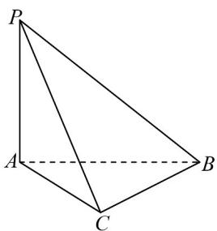

<!-- question-source:start -->
2. 如图，在三棱锥 $P - ABC$ 中， $PA \perp$ 平面 $ABC$ ， $\angle ABC = \frac{\pi}{6}$ ， $AC = \sqrt{3}$ ， $PA = 2$ ，则三棱锥 $P - ABC$ 外接球

的体积为（）

A. $\frac{8\sqrt{2}}{3}\pi$ B. $4\sqrt{3}\pi$ C. $\frac{20}{3}\sqrt{5}\pi$ D. $\frac{32}{3}\pi$
<!-- question-source:end -->

![[高中/课堂同步/题库/人教A版高中数学同步讲义(2026)/02_必修第二册/第八章 立体几何初步/讲义/专题8_6_空间直线_平面的垂直_高效培优讲义_/强化训练_sec_18/questions/answers/Q00065272A1.md]]
