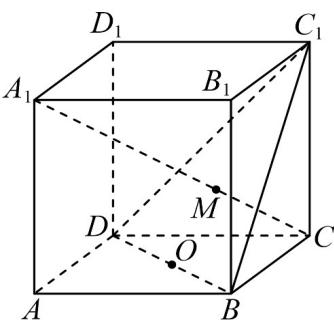

<!-- question-source:start -->
4．如图所示，在正方体 $ABCD - A_1B_1C_1D_1$ 中， $O$ 为 $DB$ 的中点，直线 $A_{1}C$ 交平面 $C_1BD$ 于点 $M$ ，则下列结论正

确的是（ ）

A. $C_1$ ， $M$ ， $O$ 三点共线 B. $A_{1}C\perp$ 平面 $C_1BD$

C．直线 $A_{1}C_{1}$ 与平面 $ABC_{1}D_{1}$ 所成角为 $\frac{\pi}{6}$ D．平面 ABCD 和平面 $C_{1}BD$ 夹角为 $\frac{\pi}{6}$
<!-- question-source:end -->

![[高中/课堂同步/题库/人教A版高中数学同步讲义(2026)/02_必修第二册/第八章 立体几何初步/讲义/专题8_6_空间直线_平面的垂直_高效培优讲义_/强化训练_sec_18/questions/answers/Q00065274A1.md]]
