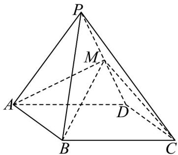

<!-- question-source:start -->
5. 如图，在四棱锥 $P - ABCD$ 中，已知底面 $ABCD$ 为矩形，侧面 $PAD$ 是正三角形，侧面 $PAD \perp$ 底面 $ABCD$

$M$ 是棱 $PD$ 的中点， $AD = 2$

(1)证明： $AM\perp$ 平面 $PCD$ ；

(2)若 $AB = \sqrt{3}$ ，求二面角 $P - BC - D$
<!-- question-source:end -->

![[高中/课堂同步/题库/人教A版高中数学同步讲义(2026)/02_必修第二册/第八章 立体几何初步/讲义/专题8_6_空间直线_平面的垂直_高效培优讲义_/强化训练_sec_18/questions/answers/Q00065275A1.md]]
