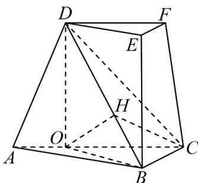

> [!faq]- 《专题8_6_空间直线_平面的垂直_高效培优讲义_》官方解析
>
> > [!success]- **【答案】** (1)证明过程见解析； (2) $\frac{\sqrt{3}}{3}$
>
> > [!note]- **【分析】**
> > （1）作出辅助线，由面面垂直得到线面垂直， $DO_{\perp}BC$ ，由余弦定理得到 $OB=\sqrt{2}$ ，由勾股定理逆
> >
> > 定理得 $BO \perp BC$ ，所以 $BC \perp$ 平面 $BOD$ ，又 $BD \subset$ 平面 $BOD$ ，所以 $BC \perp BD$ ；
> >
> > (2) 直线 DF 与平面 DBC 夹角等于直线 AC 与平面 DBC 夹角，作出辅助线，得到 $OH \perp$ 平面 BCD，所以
> >
> > $\angle OCH$ 为直线 $AC$ 与平面 $DBC$ 夹角，由勾股定理得 $BD = \sqrt{6}$ ，进而得到 $OH = \frac{2\sqrt{3}}{3}$ ，求出 $\sin \angle OCH = \frac{OH}{OC} = \frac{\sqrt{3}}{3}$
> >
> > 得到答案·
>
> > [!note]- **【解析】**
> > （1）过点D作 $DO \perp AC$ 于点O，连接OB，
> >
> > 因为平面 $ACFD \perp$ 平面 ABC ，交线为 AC ， $DO \subset$ 平面 ACFD ，所以 $DO \perp$ 平面 ABC ，
> >
> > 因为 $BC \subset$ 平面 ABC ，所以 $DO \perp BC$
> >
> > 因为 $\angle ACD = 45^{\circ}$ ，所以 $CD = \sqrt{2}CO$ ，
> >
> > 又 $DC = 2BC = 2\sqrt{2}$ ，所以 $CO = 2, BC = \sqrt{2}$
> >
> > 又 $\angle ACB = 45^{\circ}$ ，在 $\triangle OBC$ 中，由余弦定理得 $BO = \sqrt{OC^2 + CB^2 - 2OC\cdot CB\cos 45^\circ} = \sqrt{4 + 2 - 2\times 2\sqrt{2}\times\frac{\sqrt{2}}{2}} = \sqrt{2}$
> >
> > 故 $BO^{2} + BC^{2} = CO^{2}$ ，由勾股定理逆定理得 $BO_{\perp}BC$ ，
> >
> > 因为 $DO \cap BO = O$ ，DO, $BO \subset$ 平面 BOD，所以 $BC \perp$ 平面 BOD，
> >
> > 又 $BD \subset$ 平面 BOD ，所以 $BC \perp BD$ ，又三棱台 ABC-DEF 中，EF // BC ，所以 $EF \perp BD$ ；
> >
> > 
> >
> > (2) 过点 O 作 $OH \perp BD$ 于点 H，连接 CH
> >
> > 三棱台 ABC-DEF 中，DF // AC
> >
> > 所以直线 DF 与平面 DBC 所成的角等于直线 AC 与平面 DBC 所成的角，
> >
> > 因为 $BC_{\perp}$ 平面 BOD， $OH \subset$ 平面 BOD，所以 $BC_{\perp}OH$ ，
> >
> > 又 $BD \cap BC = B$ ， $BD, BC \subset$ 平面 $BCD$ ，所以 $OH_{\perp}$ 平面 $BCD$
> >
> > 所以 $\angle OCH$ 为直线 AC 与平面 DBC 所成的角，
> >
> > 由（1）知， $DO = 2$ ， $OB = \sqrt{2}$
> >
> > 因为 $DO_{\perp}$ 平面 ABC， $OB \subset$ 平面 ABC，所以 $DO_{\perp}OB$ ，
> >
> > 由勾股定理得 $BD = \sqrt{OD^{2} + OB^{2}} = \sqrt{6}$ ，
> >
> > 所以 $OH = \frac{BO \cdot OD}{BD} = \frac{2\sqrt{2}}{\sqrt{6}} = \frac{2\sqrt{3}}{3}$
> >
> > 所以 $\sin\angle OCH=\frac{OH}{OC}=\frac{\sqrt{3}}{3}$
> >
> > $$
> > \sqrt {3}
> > $$
> >
> > 直线 $DF$ 与平面 $DBC$ 所成的角的正弦值为 3
