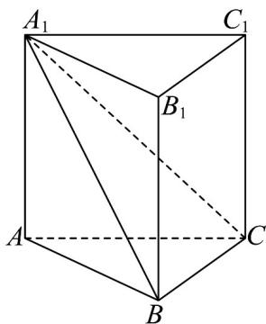
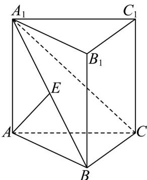

> [!faq]- 《专题8_6_空间直线_平面的垂直_高效培优讲义_》官方解析
>
> > [!success]- **【答案】**  A. $30^{\circ}$ B. $45^{\circ}$ C. $60^{\circ}$ D. $90^{\circ}$
>
> > [!note]- **【分析】**
> > 过点 A 作 $AE \perp A_{1}B$ ，垂足为 E，由平面 $A_{1}BC \perp$ 平面 $ABB_{1}A_{1}$ 可得 $AE \perp$ 平面 $A_{1}BC$ ，进而得到 $AE \perp BC$ ，结合直三棱柱的特征可得 $AA_{1} \perp BC$ ，进而得到 $BC \perp$ 平面 $ABB_{1}A_{1}$ ，可得 $\angle CA_{1}B$ 为直线与平面 $ABB_{1}A_{1}$ 所成的角，进而求解即可·
>
> > [!note]- **【解析】**
> > 过点 A 作 $AE \perp A_{1}B$ ，垂足为 E，
> >
> > 
> >
> > 因为平面 $A_{1}BC \perp$ 平面 $ABB_{1}A_{1}$ ，平面 $A_{1}BC \cap$ 平面 $ABB_{1}A_{1} = A_{1}B$ ， $AE \subset$ 平面 $ABB_{1}A_{1}$ ，所以 $AE \perp$ 平面 $A_{1}BC$
> >
> > 又 $BC \subset$ 平面 $A_{1}BC$ ，所以 $AE \perp BC$ ，
> >
> > 在直三棱柱 $ABC - A_{1}B_{1}C_{1}$ 中， $AA_{1} \perp$ 平面 $ABC$
> >
> > 因为 $BC \subset$ 平面 ABC ，所以 $AA_{1} \perp BC$
> >
> > 因为 $AA_{1} \cap AE = A, AA_{1}, AE \subset$ 平面 $ABB_{1}A_{1}$ ，所以 $BC \perp$ 平面 $ABB_{1}A_{1}$ ，而 $AB \subset$ 平面 $ABB_{1}A_{1}$
> >
> > 则 $\angle CA_{1}B$ 为直线 $A_{1}C$ 与平面 $ABB_{1}A_{1}$ 所成的角，且 $BC \perp AB$
> >
> > 因为 $AA_{1} = AB = 2$ ，且直三棱柱 $ABC - A_{1}B_{1}C_{1}$ 的体积为 $4\sqrt{6}$
> >
> > 所以 $V_{ABC-A_{1}B_{1}C_{1}} = S_{\triangle ABC} \cdot AA_{1} = \frac{1}{2} \times 2 \times BC \times 2 = 4\sqrt{6}$ ，解得 $BC = 2\sqrt{6}$ ，
> >
> > 而 $A_{1}B = 2\sqrt{2}$ ，则 $\tan \angle CA_{1}B = \frac{BC}{A_{1}B} = \frac{2\sqrt{6}}{2\sqrt{2}} = \sqrt{3}$ ，即 $\angle CA_{1}B = 60^{\circ}$ ，则 $A_{1}C$ 与平面 $ABB_{1}A_{1}$ 所成的角为 $60^{\circ}\cdot$
> >
> > 故选 **C**.
