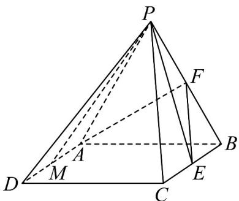
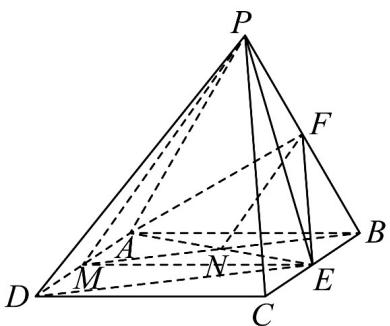
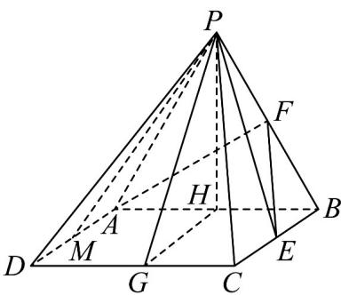

> [!faq]- 《专题8_6_空间直线_平面的垂直_高效培优讲义_》官方解析
>
> > [!success]- **【答案】** $BC, PB, AD$ 的中点.  (1)求证：PM//平面AEF； (2)求证： $AF \perp$ 平面PBC； (3)求二面角 P - DC - A 的余弦值.
>
> > [!note]- **【分析】**
> > （1）连接 $ME, AE$ ，连接 $MB$ 交 $AE$ 于点 $N$ ，连接 $FN$ ，先得到四边形 $ABEM$ 为矩形，可得 $N$ 为 $MB$
> >
> > 的中点，结合 F 为 PB 的中点，可得 $PM \parallel FN$ ，进而求证即可；
> >
> > (2) 由 $PA = AB$ ， $F$ 为 $PB$ 的中点，可得 $AF \perp PB$ ，再根据平面 $PAB \perp$ 平面 $ABCD$ 可得 $BC \perp$ 平面 $PAB$ ，进
> >
> > 而得到 $AF \perp BC$ ，进而求证即可；
> >
> > (3) 取 $H$ 为 $AB$ 的中点，作 $HG \perp DC$ ，垂足为 $G$ ，连接 $PG$ ，分析得到 $\angle PGH$ 是二面角 $P - DC - A$ 的平面
> >
> > 角，解三角形即得·
>
> > [!note]- **【解析】**
> > （1）如图，连接 $ME, AE$ ，连接 $MB$ 交 $AE$ 于点 $N$ ，连接 $FN$ ，
> >
> > 
> >
> > 因为点 $M$ 为 $AD$ 的中点， $E$ 为 $BC$ 中点，且四边形ABCD是正方形，
> >
> > 所以四边形 $ABEM$ 为矩形，故 $N$ 为 $MB$ 的中点，又因为 $F$ 为 $PB$ 的中点，所以 $PM // FN$
> >
> > 又因为 $PM \subsetneq$ 平面 $AEF$ ， $FN \subset$ 平面 $AEF$ ，所以 $PM //$ 平面 $AEF$ 。
> >
> > (2) 由 PA = AB，F 为 PB 的中点，得 $AF \perp PB$
> >
> > 又因为四边形 ABCD 是正方形，所以 $BC \perp AB$ ，
> >
> > 又因为平面 $PAB \perp$ 平面 $ABCD$ ，平面 $PAB \cap$ 平面 $ABCD = AB$ ， $BC \subset$ 平面 $ABCD$
> >
> > 所以 $BC \perp$ 平面 PAB ，又因为 $AF \subset$ 平面 PAB ，所以 $AF \perp BC$
> >
> > 又因为 $BC \cap PB = B$ ， $BC, PB \subset$ 平面 $PBC$ ，所以 $AF \perp$ 平面 $PBC$ 。
> >
> > (3) 如图，取 H 为 AB 的中点，
> >
> > 由 PA = AB ，得 $PH \perp AB$ ，
> >
> > 又因平面 $PAB \perp$ 平面 $ABCD$ ，平面 $PAB \cap$ 平面 $ABCD = AB$ ， $PH \subset$ 平面 $PAB$ ， $PH \perp$ 平面 $ABCD$
> >
> > 作 $HG \perp DC$ ，垂足为 G，连接 PG
> >
> > 
> >
> > 由 $PH \perp AB$ ，AB//DC，所以 $PH \perp DC$ ，
> >
> > 因为 $HG \cap PH = H, HG, PH \subset$ 平面 $PGH$
> >
> > 所以 $DC \perp$ 平面 $PGH$ ，又 $PG \subset$ 平面 $PGH$ ，则 $PG \perp DC$ ，所以 $\angle PGH$ 就是二面角 $P - DC - A$ 的平面角，
> >
> > 在 $\mathrm{Rt}\triangle PHG$ 中， $PH = \sqrt{3}$ ， $HG = 2$ ，得 $PG = \sqrt{7}$ ，所以 $\cos \angle PGH = \frac{HG}{PG} = \frac{2}{\sqrt{7}} = \frac{2\sqrt{7}}{7}$
> >
> > 故所求二面角 $P - DC - A$ 的余弦值为 $\frac{2\sqrt{7}}{7}$
