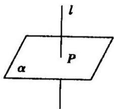
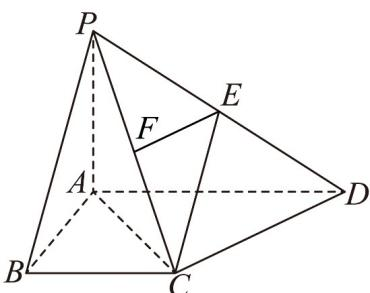
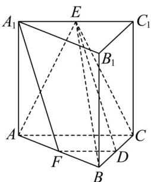

## 知识点 02 直线与平面垂直的定义与判定

1、直线和平面垂直的定义

如果直线 $l$ 和平面 $\alpha$ 内的任意一条直线都垂直，我们就说直线 $l$ 与平面 $\alpha$ 互相垂直，记作 $l \perp \alpha$ 。直线 $l$ 叫平

面 $\alpha$ 的垂线；平面 $\alpha$ 叫直线 $l$ 的垂面；垂线和平面的交点叫垂足．垂线上任意一点到垂足间的线段，叫做这

个点到这个平面的垂线段．垂线段的长度叫做这个点到平面的距离．

知识点诠释：

（1）定义中的“任何直线”与“所有直线”是同义语，定义是说这条直线和平面内所有直线垂直。

(2) 直线和平面垂直是直线和平面相交的一种特殊形式.

（3）如果一条直线垂直于一个平面，那么它就和平面内的任意一条直线垂直，简述之，即“线面垂直，则线

线垂直”，这是我们判定两条直线垂直时经常使用的一种重要方法．画直线和平面垂直时，通常要把直线画成

和表示平面的平行四边形的一边垂直，如图所示．符号语言描述： $l \perp \alpha$

（4）在平面几何中，我们有命题：经过一点有且只有一条直线与已知直线垂直，在本节中，也有类似的命题。

命题1：过一点有且只有一条直线和已知平面垂直.

命题2：过一点有且只有一个平面和已知直线垂直.

2、直线和平面垂直的判定定理

文字语言：一条直线与一个平面内的两条相交直线都垂直，则该直线与此平面垂直。

图形语言：

$$
\left. \begin{array}{l} m \subset \alpha , n \subset \alpha , m   \text {I}    n = B \\ l \perp m, l \perp n \end{array} \right\} \Rightarrow l \perp \alpha
$$

特征：线线垂直 $\Rightarrow$ 线面垂直

知识点诠释：

（1）判定定理的条件中：“平面内的两条相交直线”是关键性词语，不可忽视。

(2) 要判定一条已知直线和一个平面是否垂直，取决于在这个平面内能否找出两条相交直线和已知直线垂直，

至于这两条相交直线是否和已知直线有公共点，则无关紧要。

相关的重要结论

①过一点与已知直线垂直的平面有且只有一个；过一点与已知平面垂直的直线有且只有一条。

②如果两条平行线中的一条与一个平面垂直，那么另一条也与这个平面垂直。

③如果两个平行平面中的一个与一条直线垂直，那么另一个也与这条直线垂直。

【即学即练】

1. 如图，在四棱锥 $P - ABCD$ 中， $PA \perp$ 平面 $ABCD$ ， $E$ 为 $PD$ 的中点， $AD // BC$ ， $\angle BAD = 90^\circ$

$PA = AB = BC = 1$ $AD = 2$

(1)求证： $DC\perp$ 平面PAC；

(2)求直线 $EC$ 与平面 $PAC$ 所成角的正弦值·

【答案】(1)证明见解析 (2) $\frac{\sqrt{10}}{5}$

【分析】（1）由线面垂直的性质得到 $PA \perp CD$ ，再由勾股定理逆定理得到 $DC \perp AC$ ，即可得证；

(2) 取 $PC$ 的中点 $F$ ，连接 $EF$ ，即可得到 $EF \perp$ 平面 $PAC$ ，从而得到 $\angle ECF$ 为直线 $EC$ 与平面 $PAC$ 所成的

角，再由锐角三角函数计算可得·

【详解】（1）因为 $PA \perp$ 平面ABCD， $CD \subset$ 平面ABCD，所以 $PA \perp CD$

又四边形 $ABCD$ 为直角梯形，且 $\angle ABC = \angle BAD = 90^{\circ}$ ， $BC = \frac{1}{2} AD$

则 $AC^{2}=AB^{2}+BC^{2}=2$ ，所以 $AC=\sqrt{2}$ ，

因为 $AB = BC = 1$ ，所以 $\angle BAC = 45^{\circ}$ ，所以 $\angle DAC = 45^{\circ}$

在 $\triangle ACD$ 中，由余弦定理可得 $CD^2 = AC^2 + AD^2 - 2AC \cdot AD \cdot \cos \angle DAC = 2$

所以 $AC^2 + CD^2 = AD^2$ ，即 $DC \perp AC$

因为 $AC \cap PA = A$ ，AC， $PC \subset$ 平面 PAC，所以 $DC \perp$ 平面 PAC。

(2) 取 PC 的中点 F，连接 EF，

因为 E 为 PD 的中点，所以 $EF \parallel CD$ ，由（1）知 $DC \perp$ 平面 PAC，则 $EF \perp$ 平面 PAC

所以 $\angle ECF$ 为直线 EC 与平面 PAC 所成的角.

又 $CF \subset$ 平面 PAC ，所以 $EF \perp CF$

因为 $CF = \frac{1}{2} PC = \frac{1}{2}\sqrt{1^2 + (\sqrt{2})^2} = \frac{\sqrt{3}}{2}, EF = \frac{1}{2} CD = \frac{\sqrt{2}}{2}$

又 $CE = \sqrt{CF^2 + FE^2} = \frac{\sqrt{5}}{2}$

所以 $\sin\angle ECF=\frac{EF}{CE}=\frac{\frac{\sqrt{2}}{2}}{\frac{\sqrt{5}}{2}}=\frac{\sqrt{10}}{5}$

所以直线 $EC$ 与平面 $PAC$ 所成角的正弦值为 $\frac{\sqrt{10}}{5}$

2．如图，在直三棱柱 $ABC-A_{1}B_{1}C_{1}$ 中， $AB\perp BC$ ， $AA_{1}=AC=2$ ，BC=1，E，F分别是 $A_{1}C_{1}$ ，AB 的中点·

(1)求证： $BC\perp$ 平面 $A_{1}ABB_{1}$

(2)求证： $A_{1}F //$ 平面 BCE；

(3)求点 B 到平面 ACE 的距离.

【答案】(1)证明见解析 (2)证明见解析 (3) $\frac{\sqrt{3}}{2}$

【分析】（1）由 $AA_{1} \perp$ 平面 ABC 得 $AA_{1} \perp BC$ ，结合 $AB \perp BC$ 利用线面垂直的判定定理可证；

(2) 取 $D$ 为 $BC$ 的中点，连接 $DF, DE$ ，先证明四边形 $DFA_{1}E$ 为平行四边形，再利用线面平行的判定定理可

证；

(3) 利用等体积法计算出三棱锥 B-ACE 的体积，再求出 $\triangle ACE$ 的面积，即可求得点 B 到平面 ACE 的距离.

【详解】（1）在直三棱柱 $ABC - A_{1}B_{1}C_{1}$ 中， $AA_{1} \perp$ 平面 $ABC$ ， $BC \subset$ 平面 $ABC$ ，所以 $AA_{1} \perp BC$

又 $AB \perp BC$ ， $AA_{1} \cap AB = A$ ， $AB$ 、 $AA_{1} \subset$ 平面 $A_{1}ABB_{1}$ ，所以 $BC \perp$ 平面 $A_{1}ABB_{1}$

(2) 取 D 为 BC 的中点，连接 DF, DE，因为 F 是 AB 的中点，故 $DF \parallel AC$ ，且 $DF = \frac{1}{2} AC$

又 $AC / / A_{1}C_{1}$ ，且 $AC = A_{1}C_{1}$ ，所以 $DF / / A_{1}C_{1}$ ，且 $DF = \frac{1}{2} A_{1}C_{1}$

又 $AE = \frac{1}{2} A_{1}C_{1}$ ，所以 $DF / / A_{1}E$ ，且 $DF = A_{1}E$ ，所以四边形 $DFA_{1}E$ 为平行四边形，

所以 $DE \parallel A_{1}F$ ，而 $DE \subset$ 平面 BCE， $A_{1}F \not\subset$ 平面 BCE， $A_{1}F \parallel$ 平面 BCE；

(3) 由题意 $AB \perp BC$ ， $AC = 2$ ， $BC = 1$ ，所以 $AB = \sqrt{2^2 - 1^2} = \sqrt{3}$

因为 E 是 $A_{1}C_{1}$ 的中点， $AA_{1} \perp$ 平面 ABC，

所以 $V_{E-ABC}=\frac{1}{3}S_{\triangle ABC}\cdot AA_{1}=\frac{1}{3}\times\frac{1}{2}\times1\times\sqrt{3}\times2=\frac{\sqrt{3}}{3}$ ，所以 $V_{B-ACE}=V_{E-ABC}=\frac{\sqrt{3}}{3}$

又 $S_{\triangle ACE} = \frac{1}{2} AC\cdot AA_1 = \frac{1}{2}\times 2\times 2 = 2$

设点 B 到平面 ACE 的距离为 d，则 $V_{B-ACE} = \frac{1}{3} \times 2 \times d = \frac{\sqrt{3}}{3}$ ，解得 $d = \frac{\sqrt{3}}{2}$ ，所以点 B 到平面 ACE 的距离为 $\frac{\sqrt{3}}{2}$ 。
