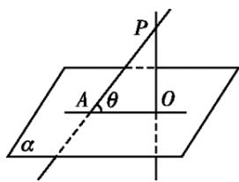
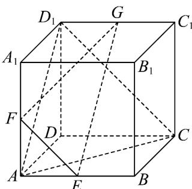
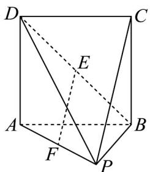
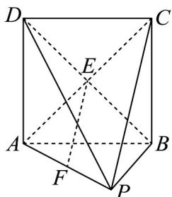

## 知识点 03 直线与平面所成的角

1、如图，一条直线 $PA$ 和一个平面 $\alpha$ 相交，但不和这个平面垂直，这条直线叫做这个平面的斜线，斜线和平

面的交点 $A$ 叫做斜足，过斜线上斜足以外的一点向平面引垂线 $PO$ ，过垂足 $O$ 和斜足 $A$ 的直线 $AO$ 叫做斜线

在这个平面上的射影，平面的一条斜线和它在平面上的射影所成的锐角，叫做这条直线和这个平面所成的角。

2、一条直线垂直于平面，称它们所成的角是直角；一条直线在平面内或一条直线和平面平行，称它们所成的

角是 $0^{\circ}$ 的角，于是，直线与平面所成的角 $\theta$ 的范围是 $0^{\circ} \leq \theta \leq 90^{\circ}$

【即学即练】

1. 已知正方体 $ABCD - A_{1}B_{1}C_{1}D_{1}$ 中，点 $E, F, G$ 分别为棱 $AB, AA_{1}, C_{1}D_{1}$ 的中点，给出下列四个结论：

其中不正确结论是（ ）

A. 直线 $FG$ 与平面 $ACD_{1}$ 相交；

B. $B_{1}D \perp$ 平面 EFG ;

C. 若 $AB = 1$ ，则点 $D$ 到平面 $ACD_{1}$ 的距离为 $\frac{\sqrt{3}}{3}$ ；

D．该正方体的棱所在直线与平面 EFG 所成的角都相等．

【答案】A

【分析】①先证 $AD_{1} // EG, EF // CD_{1}$ ，可得平面 EFG // 平面 $ACD_{1}$ ，从而知 FG // 平面 $ACD_{1}$ ，可判断 A 的真

假；②利用三垂线定理可得 $B_{1}D \perp AC, B_{1}D \perp CD_{1}$ ，再由线面垂直的判定定理知 $B_{1}D \perp \text{平面 } ACD_{1}$ ，并结合平

面 $EFG //$ 平面 $ACD_{1}$ ，可判断 $\mathsf{B}$ 的真假；③易知 $\triangle ACD_{1}$ 是边长为 $\sqrt{2}$ 的等边三角形，再利用等体积法可求点到

面的距离，判断 $^{C}$ 的真假；④结合四面体 $D-ACD_{1}$ 是正三棱锥，且正方体的棱构成三组平行线，即可判断 $^{D}$

的真假.

【详解】①因为点 E, G 分别为棱 AB, $C_{1}D_{1}$ 的中点，

所以 $AE \parallel D_{1}G$ , $AE = D_{1}G$ ，即四边形 $AEGD_{1}$ 是平行四边形，

所以 $AD_{1} // EG$

又因为 $AD_{1} \subset$ 平面 $ACD_{1}$ ， $EG \not\subset$ 平面 $ACD_{1}$ ，所以 $EG \parallel$ 平面 $ACD_{1}$ .

因为点 $E, F$ 分别为棱 $AB, AA_{1}$ 的中点，所以 $EF // A_{1}B // CD_{1}$

又因为 $CD_{1} \subset$ 平面 $ACD_{1}$ ， $EF \not\subset$ 平面 $ACD_{1}$ ，所以 $EF \parallel$ 平面 $ACD_{1}$ .

因为 $EG \cap EF = E$ ，EG、EF ⊂ 平面 EFG，

所以平面 EFG // 平面 $ACD_{1}$ .

因为 $FG \subset$ 平面 EFG ，所以直线 $FG \parallel$ 平面 $ACD_{1}$ ，即 A 错误；

②由三垂线定理知， $B_{1}D \perp AC, B_{1}D \perp CD_{1}$

因为 $AC \cap CD_{1} = C, AC, CD_{1} \subset$ 平面 $ACD_{1}$ ，所以 $B_{1}D \perp$ 平面 $ACD_{1}$ ，

由①知平面 $EFG \parallel$ 平面 $ACD_{1}$ ，所以 $B_{1}D \perp$ 平面 EFG，即 B 正确；

③若 $AB = 1$ ，则 $\triangle ACD_{1}$ 是边长为 $\sqrt{2}$ 的等边三角形，所以 $S_{\triangle ACD_1} = \frac{1}{2}\times \sqrt{2}\times \sqrt{2}\times \sin \frac{\pi}{3} = \frac{\sqrt{3}}{2}$

设点D到平面 $ACD_{1}$ 的距离为d，

因为 $V_{D-ACD_{1}} = V_{D_{1}-ACD}$ ，所以 $\frac{1}{3}d \cdot S_{\triangle ACD_{1}} = \frac{1}{3} \cdot DD_{1} \cdot S_{\triangle ACD}$ ，所以 $d = \frac{1 \times \frac{1}{2} \times 1 \times 1}{\frac{\sqrt{3}}{2}} = \frac{\sqrt{3}}{3}$ ，

$$
\sqrt {3}
$$

所以点 D 到平面 $ACD_{1}$ 的距离为 $\overline{3}$ ，即 C 正确；

④由题意知，四面体 $D - ACD_{1}$ 的底面是等边 $\triangle ACD_{1}$ ，且 $DA = DC = DD_{1}$

即四面体 $D - ACD_{1}$ 是正三棱锥，

所以三条侧棱 DA, DC, $DD_{1}$ 与底面 $ACD_{1}$ 所成角均相等，

而 $DA\parallel D_1A_1\parallel CB\parallel C_1B_1$ ， $DC\parallel D_1C_1\parallel AB\parallel A_1B_1$ ， $DD_{1}\parallel AA_{1}\parallel BB_{1}\parallel CC_{1}$

所以该正方体的棱所在直线与平面 $ACD_{1}$ 所成的角都相等，

由①知平面 $EFG //$ 平面 $ACD_{1}$

所以该正方体的棱所在直线与平面 EFG 所成的角都相等，即 D 正确。

故选：A

2. 如图，在四棱锥 $P - ABCD$ 中，底面 $ABCD$ 是边长为 2 的正方形，点 $E, F$ 分别是 $BD, AP$ 的中点.

(1)证明： $EF \parallel$ 平面PBC；

(2)若 $PA = PC = 2\sqrt{2}$ ，求直线 $PC$ 与平面 $PBD$ 所成角的大小.

【答案】(1)证明见解析 (2) $\frac{\pi}{6}$

【分析】（1）连接 $AC$ ，利用三角形中位线定理证明 $EF//PC$ ，再由线线平行证线面平行即可·

(2) 先证明 $AC \perp$ 平面 PBD，即得 $\angle CPE$ 为直线 PC 与平面 PBD 所成角，借助于 $Rt^{\triangle} CPE$ ，即可求得答案.

【详解】（1）如图，连接 $AC$ ，因为四边形ABCD是正方形，所以点 $E$ 是 $AC$ 的中点，

又因 F 是 AP 的中点，故得 $EF \parallel PC$ ，

又因 $EF \notin$ 平面 $PBC$ ， $PC \subset$ 平面 $PBC$ ，所以 $EF //$ 平面 $PBC$

(2) 如图，连接 $EP$ ，由 (1) 得 $E$ 是 $AC$ 中点，

因为 PA = PC ，所以 $EP \perp AC$ ，

又因为底面 $ABCD$ 是正方形，且 $AC, BD$ 为对角线，所以 $BD \perp AC$

又因为 BDI $EP = E, BD, EP \subset$ 平面 PBD ，所以 $AC \perp$ 平面 PBD

所以直线 $PC$ 与平面 $PBD$ 所成角为 $\angle CPE$

因为在 $\mathrm{Rt}^{\triangle}$ CPE中， $CE = \sqrt{2}, PC = 2\sqrt{2}$ ，则 $\sin \angle CPE = \frac{CE}{PC} = \frac{1}{2}$

故 $\angle CPE = \frac{\pi}{6}$ ，即直线 $PC$ 与平面 $PBD$ 所成角的大小为 $\frac{\pi}{6}$
