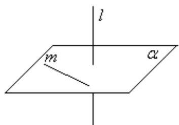
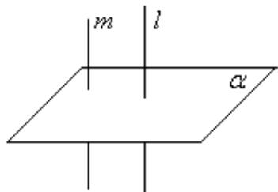
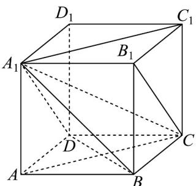
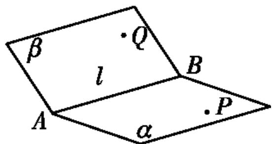
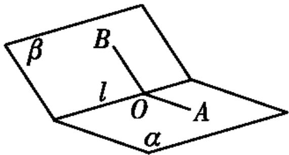
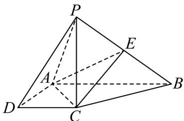
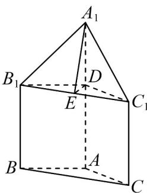

## 知识点 04 直线与平面垂直的性质

## 1、基本性质

文字语言：一条直线垂直于一个平面，那么这条直线垂直于这个平面内的所有直线。

符号语言： $l\perp \alpha ,m\subset \alpha \Rightarrow l\perp m$

图形语言：

2、性质定理

文字语言：垂直于同一个平面的两条直线平行。

符号语言： $l\perp \alpha ,m\perp \alpha \Rightarrow l / / m$

图形语言：

【即学即练】

1. 如图， $PA \perp$ 矩形 ABCD 所在的平面，M, N 分别是 AB, PC 的中点.

(1)求证： $MN / /$ 平面PAD；

(2)若 $PD$ 与平面 $ABCD$ 所成的角为 $\alpha$ ，当 $\alpha$ 为多少度时， $MN \perp$ 平面 $PCD?$

【答案】(1)证明见解析 (2) $\frac{\pi}{4}$

【分析】（1）取 $PD$ 的中点 $E$ ，连接 $NE, AE$ ，利用几何关系得 $MN // AE$ ，再利用线面平行的判定，即可求

解；

(2) 利用线面角的定义，知 $\angle PDA$ 即为 $PD$ 与平面 $ABCD$ 所成的角，从而 $\alpha = 45^{\circ}$ 时， $AE \perp PD$ ，进而可得

$MN \perp PD$ ，再由线面垂直的性质和线面垂直的判定得 $CD \perp MN$ ，再由线面垂直的判定，即可求解

【详解】（1）取 $PD$ 的中点 $E$ ，连接 $NE, AE$ ，如图，

因为 N 是 PC 的中点，所以 $NE \parallel DC$ 且 $NE = \frac{1}{2} DC$ ，

又因为 DC // AB 且 DC = AB ， $AM = \frac{1}{2} AB$ ，

所以 $AM / / CD$ 且 $AM = \frac{1}{2} CD$ ，所以 $NE / / AM$ ，且 $NE = AM$ ，

所以四边形 AMNE 是平行四边形，则 $MN \parallel AE$ ，

又 $AE \subset$ 平面 PAD ， $MN \not\subset$ 平面 PAD ， 所以 MN // 平面 PAD ·

(2) $\alpha = 45^{\circ}$ 时， $MN \perp$ 平面 $PCD$ ，证明如下，

因为 $PA \perp$ 平面 $ABCD$ ，所以 $\angle PDA$ 即为 $PD$ 与平面 $ABCD$ 所成的角，

当 $\angle PDA = 45^{\circ}$ 时，则 AP = AD ，所以 $AE \perp PD$

又由 $(1)$ 知 $MN // AE$ ，所以 $MN \perp PD$ ，

因为 $PA \perp$ 平面 ABCD ， $CD \subset$ 平面 ABCD ，所以 $PA \perp CD$

又∵CD⊥AD，PA∩AD=A，PA,AD⊂平面PAD，

$\therefore CD \perp$ 平面 PAD， $\because AE \subset$ 平面 PAD， $\therefore CD \perp AE$ ， $\therefore CD \perp MN$

又 $CD \cap PD = D, CD, PD \subset$ 平面 $PCD$ ，所以 $MN \perp$ 平面 $PCD$ .

2. 在边长为 1 的正方体 $ABCD-A_{1}B_{1}C_{1}D_{1}$ 中，下列选项中，正确的是（）

【答案】

A. $A_{1}C_{1}\perp BD$ B. $B_{1}C$ 与 BD 所成的角为 $60^{\circ}$ C. $A_{1}C$ 与平面 ABCD 所成的角为 $45^{\circ}$ D. 三棱锥 $A_{1}-ABD$ 的外接球半径为 $\frac{\sqrt{3}}{2}$

【答案】ABD

【分析】选项 A，由 $AC \perp BD$ 和 $AC // A_{1}C_{1}$ 得到 $A_{1}C_{1} \perp BD$ ；选项 B，由 $A_{1}D // B_{1}C$ 得到 $\angle A_{1}DB$ 为 $B_{1}C$ 和 BD 所成的角，又 $\triangle A_{1}DB$ 为等边三角形得到 $B_{1}C$ 和 BD 所成的角为 $60^{\circ}$ ；选项 C， $AA_{1} \perp$ 平面 ABCD 得到 $\angle ACA_{1}$ 为 $A_{1}C$ 与平面 ABCD 所成的角，从而得到 $\tan \angle ACA_{1} \neq 1$ ，则 $\angle ACA_{1} \neq 45^{\circ}$ ；选项 D，由三棱锥 $A_{1}-ABD$ 的外接球

就是正方体 $ABCD - A_{1}B_{1}C_{1}D_{1}$ 的外接球，利用正方体求得三棱锥 $A_{1}-ABD$ 的外接球的半径。

【详解】选项 A，∵ $ABCD - A_{1}B_{1}C_{1}D_{1}$ 是正方体，∴ ABCD 是正方形，∴ $AC \perp BD$

∵ $AC // A_{1}C_{1}$ ，∴ $A_{1}C_{1} \perp BD$ ，∴ 选项 A 正确；

选项 B，∵ $ABCD - A_{1}B_{1}C_{1}D_{1}$ 是正方体，∴ $A_{1}D // B_{1}C$ ，∴ $\angle A_{1}DB$ 为 $B_{1}C$ 和 BD 所成的角，

又 $Q^{\triangle}A_{1}DB$ 为等边三角形， $\therefore\angle A_{1}DB=60^{\circ}$

$\therefore B_{1}C$ 和 BD 所成的角为 $60^{\circ}$ ，∴ 选项 B 正确；

选项 C，∵ $ABCD - A_{1}B_{1}C_{1}D_{1}$ 是正方体，∴ $AA_{1} \perp$ 平面 ABCD，

$\therefore \angle ACA_{1}$ 为 $A_{1}C$ 与平面 ABCD 所成的角，

∵ 正方体 $ABCD - A_{1}B_{1}C_{1}D_{1}$ 的棱长为 1，∴ $AC = \sqrt{2}$

∴ 在 $Rt\triangle ACA_{1}$ 中， $\tan\angle ACA_{1}=\frac{AA_{1}}{AC}=\frac{1}{\sqrt{2}}\neq1$ ， $\therefore\angle ACA_{1}\neq45^{\circ}$ ，∴选项 C 错误；

选项 D，∵ 三棱锥 $A_{1}-ABD$ 的外接球就是正方体 $ABCD-A_{1}B_{1}C_{1}D_{1}$ 的外接球，

∴三棱锥 $A_{1}-ABD$ 的外接球的半径为 $\frac{1}{2}\sqrt{1+1+1}=\frac{\sqrt{3}}{2}$ ，∴选项 D 正确.

故选：ABD.

知识点 05 二面角

1、定义：从一条直线出发的两个半平面所组成的图形叫做二面角，这条直线叫二面角的棱，这两个半平面叫

二面角的面．图中的二面角可记作：二面角 $\alpha-AB-\beta$ 或 $\alpha-l-\beta$ 或 P-AB-Q．

2、二面角的平面角：如图，在二面角 $\alpha - l - \beta$ 的棱 $l$ 上任取一点 $O$ ，以点 $O$ 为垂足，在半平面 $\alpha$ 和 $\beta$ 内分别

作垂直与直线 $l$ 的射线 $OA$ ， $OB$ ，则射线 $OA$ 和 $OB$ 构成的 $\angle AOB$ 叫做二面角的平面角．平面角是直角的二面

角叫做直二面角．

【即学即练】

1. 如图所示，在四棱锥 $P - ABCD$ 中， $PC \perp$ 底面 $ABCD$ ，四边形 $ABCD$ 是直角梯形， $AB \perp AD$ ， $AB // CD$

$PC = AB = 2AD = 2CD = 2$ ， $E_{\text{是}}PB$ 的中点

(1)求证：平面 $EAC \perp$ 平面 $PBC$ .

(2)求二面角 P - AC - E 的余弦值.

(3) 点 F 在直线 PB 上，且 $PD \parallel$ 平面 ACF，求出 PF 的长·

【答案】(1)证明见解析 (2) $\frac{\sqrt{6}}{3}$ (3) $\frac{\sqrt{6}}{3}$

【分析】（1）利用线面垂直的判定定理即可得证；

(2) 由 (1) 可知 $AC \perp$ 平面 $PBC$ 得 $AC \perp PC$ ， $AC \perp CE$ ，即 $\angle PCE$ 为二面角 $P - AC - E$ 的平面角，在 $\triangle PCE$

中利用余弦定理即可求解；

(3) 连接 BD 交 AC 于 O，过 O 作 OF // PD 交 PB 于 F，连接 AF，CF，进而得 PD // 平面 ACF，由

$\frac{OB}{OD}=\frac{AB}{DC}=2$ 结合 $\frac{OB}{OD}=\frac{BF}{PF}$ 即可求解.

【详解】（1）四边形ABCD是直角梯形，AB=2CD=2AD=2

$$
\therefore A C = B C = \sqrt {2} \quad A C \perp B C
$$

∵ $PC \perp$ 平面 ABCD， $AC \subset$ 平面 ABCD

∴ $PC \perp AC$ ，又 $PC \cap BC = C$ ，PC，BC ⊂ 平面 PBC

$\therefore AC \perp$ 平面 PBC，又 $AC \subset$ 平面 EAC，

∴ 平面 $EAC \perp$ 平面 PBC;

(2) 由(1)可知 $AC \perp$ 平面 PBC，

∵ PC，CE ⊂ 平面 PBC，∴ AC ⊥ PC，AC ⊥ CE，∴ ∠PCE 为二面角 P - AC - E 的平面角，

$\because PC = 2, BC = \sqrt{2}, \therefore CE = PE = \frac{1}{2} PB = \frac{1}{2} \cdot \sqrt{4 + 2} = \frac{\sqrt{6}}{2}$

$\therefore \cos \angle PCE = \frac{PC^2 + CE^2 - PE^2}{2PC \cdot CE} = \frac{\sqrt{6}}{3}.$ $\therefore$ 二面角 $P - AC - E$ 的余弦值为 $\frac{\sqrt{6}}{3}$ ;

(3) 连接 BD 交 AC 于 O，过 O 作 OF // PD 交 PB 于 F，连接 AF，CF.

由 $OF \subset$ 平面 ACF， $PD \notin$ 平面 ACF，得 $PD \parallel$ 平面 ACF.

$\because AB // CD, \therefore \frac{OB}{OD} = \frac{AB}{DC} = 2$ ，又 $OF // PD, \therefore \frac{OB}{OD} = \frac{BF}{PF} = 2, \therefore PF = \frac{1}{3} PB = \frac{\sqrt{6}}{3}$ .

2．祈年殿（图1）是北京市的标志性建筑之一，距今已有 $^{600}$ 多年历史·殿内部有垂直于地面的 $^{28}$ 根木柱，
分三圈环形均匀排列·内圈有 $^{4}$ 根约为 $^{19}$ 米的龙井柱，寓意一年四季；中圈有 $^{12}$ 根约为 $^{13}$ 米的金柱，代表十二个月；外圈有 $^{12}$ 根约为6米的檐柱，象征十二个时辰·已知由一根龙井柱 $AA_{1}$ 和两根金柱 $BB_{1}$ ， $CC_{1}$ 形成的几何体 $ABC-A_{1}B_{1}C_{1}$ （图2）中， $AB=AC\approx8$ 米， $\angle BAC\approx144^{\circ}$ ，则平面 $A_{1}B_{1}C_{1}$ 与平面ABC所成角的正切值约为（）

图1

图2

A. $\frac{7}{8\sin18^{\circ}}$ B. $\frac{3}{4\sin18^{\circ}}$ C. $\frac{7}{8\cos18^{\circ}}$ D. $\frac{3}{4\cos18^{\circ}}$

【答案】B

【分析】若平面 $ABC / /$ 平面 $DB_{1}C_{1}$ ， $E$ 是 $B_{1}C_{1}$ 的中点，连接 $DE, A_{1}E$ ，从而得到 $\angle A_{1}ED$ 是平面 $A_{1}B_{1}C_{1}$ 与平面 $DB_{1}C_{1}$ 所成角的平面角，即为所求角，结合已知求其正切值·
【详解】过 $B_{1}C_{1}$ 作平面 $DB_{1}C_{1} / /$ 平面 $ABC$ ，交 $AA_{1}$ 于点 $D$

则平面 $A_{1}B_{1}C_{1}$ 与平面 $ABC$ 所成角，即为平面 $A_{1}B_{1}C_{1}$ 与平面 $DB_{1}C_{1}$ 所成角，

由题意有 $\triangle ABC \cong \triangle DB_{1}C_{1}$ ，即 $\triangle DB_{1}C_{1}$ 是等腰三角形，腰长约为 8 米， $\angle B_{1}DC_{1} \approx 144^{\circ}$ ，易知

$$
\angle D B _ {1} C _ {1} = \angle D C _ {1} B _ {1} \approx 1 8 ^ {\circ}
$$

若 $E$ 是 $B_{1}C_{1}$ 的中点，连接 $DE, A_{1}E$ ，则 $DE \perp B_{1}C_{1}$ ，且 $A_{1}D \perp$ 平面 $DB_{1}C_{1}$

由 $B_{1}C_{1}\subset$ 平面 $DB_{1}C_{1}$ ，则 $A_{1}D\perp B_{1}C_{1}$ ， $DE\cap A_1D = D$ 都在平面 $A_{1}DE$ 内，

所以 $B_{1}C_{1} \perp$ 平面 $A_{1}DE$ ，又 $A_{1}E, A_{1}D \subset$ 平面 $A_{1}DE$ ，

所以 $B_{1}C_{1}\perp A_{1}E,B_{1}C_{1}\perp A_{1}D$ ，又 $B_{1}C_{1}$ 为平面 $A_{1}B_{1}C_{1}$ 与平面 $DB_{1}C_{1}$ 的交线，

则 $\angle A_{1}ED$ 是平面 $A_{1}B_{1}C_{1}$ 与平面 $DB_{1}C_{1}$ 所成角的平面角，

其中 $A_{1}D=19-13=6$ ， $DE=8\sin18^{\circ}$ ，则 $\tan\angle A_{1}ED=\frac{A_{1}D}{DE}=\frac{3}{4\sin18^{\circ}}$

故选：B
