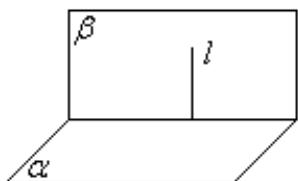
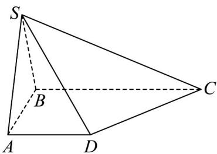
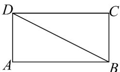
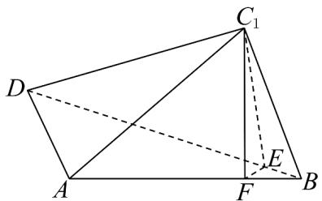

## 知识点 06 平面与平面垂直的定义与判定

1、平面与平面垂直定义

定义：两个平面相交，如果它们所成的二面角是直二面角，就说这两个平面垂直。

表示方法：平面 $\alpha$ 与 $\beta$ 垂直，记作 $\alpha \perp \beta$

画法：两个互相垂直的平面通常把直立平面的竖边画成与水平平面的横边垂直．如图：

2、平面与平面垂直的判定定理

文字语言：一个平面过另一个平面的垂线，则这两个平面垂直。

符号语言： $l\perp \alpha ,l\subset \beta \Rightarrow \alpha \perp \beta$

图形语言：

特征：线面垂直 $\Rightarrow$ 面面垂直

知识点诠释：平面与平面垂直的判定定理告诉我们，可以通过直线与平面垂直来证明平面与平面垂直。通常

我们将其记为“线面垂直，则面面垂直”。因此，处理面面垂直问题转化为处理线面垂直问题，进一步转化为

处理线线垂直问题．以后证明平面与平面垂直，只要在一个平面内找到两条相交直线和另一个平面内的一条

直线垂直即可.

【即学即练】

1. 如图，在四棱锥 $S - ABCD$ 中，底面 $ABCD$ 为直角梯形， $AD // BC, AB \perp BC$ ，平面 $SBC \perp$ 平面 $SAB$ ， $AB = AS, BC = 2AD$

(1)求证：平面 $SAB \perp$ 平面 ABCD；

(2)若 $\triangle SAB$ 为等边三角形，边长为 $2$ ， $SD$ 与底面 $ABCD$ 所成角为 $\overline{6}$ ，求四棱锥 $S - ABCD$ 的体积.

$$
\frac {\pi}{6}
$$

【答案】(1)证明见解析 (2) $2\sqrt{6}$

【分析】（1）先证明 $BC \perp$ 平面 SAB，再根据面面垂直的判定定理证明面面垂直.

(2) 根据锥体的体积公式求锥体体积·

【详解】（1）如图：

取 $BS$ 中点 $M$ ，连接 $AM$ ， $\because AB = AS, M$ 为中点 $\therefore AM \perp BS$

又∵平面 $SBC \perp$ 平面 SAB ，平面 SBCI 平面 $SAB = BS$ ， $AM \subset$ 平面 SAB

$\therefore AM \perp$ 平面 $SBC$ ，又 $\because BC \subset$ 平面 $SBC \therefore AM \perp BC$

$\therefore AB \perp BC, AM \cap AB = A, AM, AB \subset$ 平面 $SAB$

$\therefore BC \perp$ 平面 $SAB$

又∵ $BC \subset$ 平面ABCD，∴平面 $SAB \perp$ 平面ABCD.

(2) 取 $AB$ 中点 $O$ ，连接 $SO$ ，连接 $DO$ ，同理可证 $SO \perp$ 平面 $ABCD$

则 $\angle ODS$ 为 $SD$ 与底面 $ABCD$ 所成角的平面角.

$\because \Delta SAB$ 为等边三角形，边长为 $2$ ， $\therefore SO = \sqrt{3}$

在 $Rt\triangle SOD$ 中，解得 DO = 3 ，在 $Rt\triangle OAD$ 中，解得 $AD = 2\sqrt{2}$

则 $BC = 4\sqrt{2}$

$$
\therefore S _ {\text {梯形ABCD}} = \frac {1}{2} \Big (4 \sqrt {2} + 2 \sqrt {2} \Big) \times 2 = 6 \sqrt {2}
$$

$$
\therefore V = \frac {1}{3} S _ {\text {梯形} A B C D} \times S O = \frac {1}{3} \times 6 \sqrt {2} \times \sqrt {3} = 2 \sqrt {6}
$$

2．如图1，在矩形ABCD中， $AB=2$ ， $AD=\sqrt{3}$ ，将△BCD沿BD翻折至△BC\_{1}D，且 $AC_{1}=1$ ，如图2所示.

图1

图2

(1)求证：平面 $ABC_{l}\perp$ 平面 $AC_{l}D$ ；

(2)求点 $C_{l}$ 到平面 ABD 的距离 d；

(3)求二面角 $C_1 - BD - A$ 的余弦值.

【答案】(1)证明详见解析 (2) $d = \frac{\sqrt{3}}{2}$ (3) $\frac{3}{4}$

【分析】（1）根据勾股定理可证 $AC_{1} \perp BC_{1}$ ，再结合线面垂直的判定定理可证 $BC_{1} \perp$ 平面 $AC_{1}D$ ，然后根据

面面垂直的判定定理证明即可；

(2) 根据等体积法，利用三棱锥的体积求点到平面的距离即可；

(3) 根据二面角的定义做出二面角的平面角，然后利用直角三角形的性质求解即可·

【详解】（1）由题得，在△ $ABC_{1}$ 中， $AC_{1}^{2}+BC_{1}^{2}=AB^{2}$ ，所以 $AC_{1}\perp BC_{1}$ .

又因为矩形ABCD，所以 $DC_{1}\perp BC_{1}$ .

因为 $AC_{1} \cap DC_{1} = C_{1}$ ， $AC_{1} \subset$ 平面 $AC_{1}D$ ， $DC_{1} \subset$ 平面 $AC_{1}D$

所以 $BC_{1} \perp$ 平面 $AC_{1}D$ .

又 $BC_{1} \subset$ 平面 $ABC_{1}$ ，所以平面 $ABC_{1} \perp$ 平面 $AC_{1}D$ .

(2) 在 $\triangle ADC_{1}$ 中， $AD^{2} + AC_{1}^{2} = DC_{1}^{2}$ ，所以 $AD \perp AC_{1}$ ，所以 $S_{\triangle ADC_{1}} = \frac{1}{2} \times AD \times AC_{1} = \frac{\sqrt{3}}{2}$ .

在直角 $\triangle ABD$ 中， $S_{\triangle ABD}=\frac{1}{2}\times AD\times AB=\sqrt{3}$

由（1）知 $BC_{1} \perp$ 平面 $AC_{1}D$ ，所以点 $B$ 到平面 $AC_{1}D$ 的距离为 $BC_{1}$

设点 $C_{l}$ 到平面 ABD 的距离为 d，

由 $V_{三棱锥C_{1}-ABD}=V_{三棱锥B-AC_{1}D}$ ，得 $\frac{1}{3}\times S_{\triangle ABD}\times d=\frac{1}{3}\times S_{\triangle AC_{1}D}\times BC_{1}$

所以 $d=\frac{S_{\triangle AC_{1}D}\times BC_{1}}{S_{\triangle ABD}}=\frac{\sqrt{3}}{2}$

(3) 如图，在平面 $C_{1}BD$ 内作 $C_{1}E \perp BD$ 于点 E，在平面 $ABC_{1}$ 内作 $C_{1}F \perp AB$ 于点 F，连接 EF·

由（2）知 $AD \perp AC_{1}$ ， $AD \perp AB$ ，又 $AB \cap AC_{1} = A$ ， $AC_{1}, AB \subset$ 平面 $ABC_{1}$ ，所以 $AD \perp$ 平面 $ABC_{1}$

因为 $C_{1}F \subset$ 平面 $ABC_{1}$ ，故 $AD \perp C_{1}F$ 。

因为 $C_{1}F \perp AB$ ， $AB \cap AD = A$ ， $AB, AD \subset$ 平面 ABD，所以 $C_{1}F \perp$ 平面 ABD.

又 $BD \subset$ 平面 ABD ，所以 $C_{1}F \perp BD$

因为 $C_1E \perp BD$ ， $C_1E \cap C_1F = C_1$ ， $C_1E, C_1F \subset$ 平面 $C_1EF$ ，所以 $BD \perp$ 平面 $C_1EF$

又 $EF \subset$ 平面 $C_{1}EF$ ，所以 $BD \perp EF$ ，又 $C_{1}E \perp BD$ ，

所以 $\angle C_{1}EF$ 为二面角 $C_{1}-BD-A$ 的平面角.

因为 $S_{\triangle ABC_{1}}=\frac{1}{2}AC_{1}\times BC_{1}=\frac{1}{2}AB\times C_{1}F$ ，所以 $\frac{1}{2}\times1\times\sqrt{3}=\frac{1}{2}\times2\times C_{1}F$ ，解得 $C_{1}F=\frac{\sqrt{3}}{2}$

因为 $C_{1}F \perp$ 平面 ABD，又 $EF \subset$ 平面 ABD，故 $C_{1}F \perp EF$ ，

所以 $\cos\angle C_{1}EF=\frac{EF}{C_{1}E}$

由题意知直角三角形 $C_1BD$ 中， $BD = \sqrt{2^2 + (\sqrt{3})^2} = \sqrt{7}$ ， $\sin \angle C_1BD = \frac{DC_1}{DB} = \frac{2}{\sqrt{7}}$

故 $C_1E = BC_1\cdot \sin \angle DBC_1 = \frac{2\sqrt{21}}{7}$ ，又 $C_1F = \frac{\sqrt{3}}{2}$ ，则 $EF = \sqrt{C_1E^2 - C_1F^2} = \sqrt{\frac{27}{28}}$

所以 $\cos C_{1}EF=\frac{EF}{C_{1}E}=\frac{3}{4}$

故二面角 $C_1 - BD - A$ 的余弦值为 $\frac{3}{4}$
