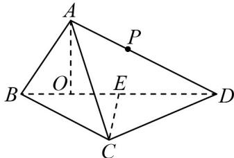
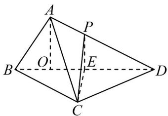
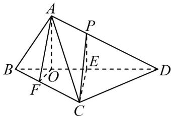

## 知识点 07 平面与平面垂直的性质

## 1、性质定理

文字语言：两个平面垂直，则一个平面内垂直于交线的直线与另一个平面垂直。

符号语言： $\alpha \perp \beta ,\alpha \cap \beta = m,l\subset \beta ,l\perp m\Rightarrow l\perp \alpha$

图形语言：

知识点诠释：面面垂直的性质定理是作线面垂直的依据和方法，在解决二面角问题中作二面角的平面角经常

用到．这种线面垂直与面面垂直间的相互转化，是我们立体几何中求解（证）问题的重要思想方法．

2、平面与平面垂直性质定理的推论

如果两个平面互相垂直，那么经过第一个平面内的一点垂直于第二个平面的直线，在第一个平面内。

【即学即练】

1. 如图， $AC$ 是圆 $O$ 的直径， $PA$ 与圆 $O$ 所在的平面垂直，且 $PA = AC = 2$ ， $B$ 为圆周上不与点 $A, C$ 重合的动

点， $M,N$ 分别为点 $A$ 在线段 $PC,PB$ 的投影

(1)证明：直线 $AN \perp$ 平面 $PBC$ ；

(2)求三棱锥 P-ABC 外接球的体积；

(3)当 $\triangle AMN$ 的面积最大时，求二面角 $A - PC - B$ 的平面角的大小.

【答案】(1)证明见解析 (2) $\frac{8\sqrt{2}\pi}{3}$ (3) $\frac{\pi}{4}$

【分析】（1）先证明 $BC \perp$ 平面 PAB 从而得到 $BC \perp AN$ ，再根据 $AN \perp PB$ 从而证明 $AN \perp$ 平面 PBC；

(2) 先证明点 M 为外接球的球心，求出半径即可求出答案；

(3) 证明 $AN \perp PC$ ， $PC \perp MN$ ，从而得到 $\angle AMN$ 即为二面角 $A - PC - B$ 的平面角，接着证明 $\triangle AMN$ 为直角

三角形，利用基本不等式得到 $\triangle AMN$ 的面积最大时 $NA = NM$ ，即可得到答案

【详解】（1）因为点 B 在圆 O 的圆周上，AC 为圆 O 的直径，所以 $AB \perp BC$ ，

又 $PA \perp$ 平面 ABC ， $BC \subset$ 平面 ABC ，所以 $PA \perp BC$

又 $AB, PA \subset$ 平面 $PAB$ ， $AB \cap PA = A$ ，所以 $BC \perp$ 平面 $PAB$ ，

因为 $AN \subset$ 平面 PAB ，所以 $BC \perp AN$ ，又 N 为 A 在 PB 上的投影，所以 $AN \perp PB$

$PB, BC \subset \text{平面} PBC, PB \cap BC = B$ ，所以 $AN \perp \text{平面} PBC$ .

(2) 因为 $PA \perp$ 平面 ABC， $AC \subset$ 平面 ABC，所以 $PA \perp AC$ ，

因为 $BC \perp$ 平面 PAB ， $PB \subset$ 平面 PAB ，所以 $BC \perp PB$

因为 $M$ 为 $PC$ 的中点，所以 $MA = MB = MP = MC = \frac{1}{2} PC = \frac{1}{2}\sqrt{PA^2 + AC^2} = \frac{1}{2}\sqrt{2^2 + 2^2} = \sqrt{2}$

所以三棱锥 $P - ABC$ 外接球的半径为 $\sqrt{2}$ ，外接球的体积为 $\frac{4}{3}\pi (\sqrt{2})^3 = \frac{8\sqrt{2}}{3}\pi$ 。

(3) 因为 $AN \perp$ 平面 PBC， $PC \subset$ 平面 PBC，所以 $AN \perp PC$ ，

又 M 为 A 在 PC 上的投影，所以 $AM \perp PC$ ， $AM, AN \subset$ 平面 AMN， $AM \cap AN = A$ ，所以 $PC \perp$ 平面 AMN，

又 $MN \subset$ 平面 $AMN$ ，所以 $PC \perp MN$ ，所以 $\angle AMN$ 即为二面角 $A - PC - B$ 的平面角，

又 $AN \perp$ 平面 $PBC$ ， $MN \subset$ 平面 $PBC$ ，所以 $AN \perp MN$ ，即 $\triangle AMN$ 为直角三角形，

且斜边 $AM = \frac{1}{2}PC = \sqrt{2}$ 为定值，

所以 $2 = NA^{2} + NM^{2}$ 2NA□NM，所以 $NA\square NM \leq 1$ ，当 $NA = NM = 1$ 时等号成立，

所以 $S_{\triangle AMN} = \frac{1}{2} NA \square NM \leq \frac{1}{2}$ ，当 $NA = NM = 1$ 时等号成立，

此时 $\triangle AMN$ 为等腰直角三角形，所以 $\angle AMN = \frac{\pi}{4}$

所以当 $\triangle A M N$ 的面积最大时，求二面角 $A - P C - B$ 的平面角的大小为 $\overline{4}$

2．如图，在三棱锥 A-BCD 中，CB=CD，点 E 为 BD 中点， $AB=\sqrt{2}$ ，平面 $ABD\perp$ 平面 BCD，点 O 在 BD

上，且 BO = 1，OD = 3，AO = 1，点 P 在 AD 上，且满足 AO // 平面 PCE.

(1)求证： $AO \perp$ 平面 BCD；

(2)求 $\frac{AP}{AD}$ 的值；

(3)若二面角 A-BC-D 的大小为 $\frac{\pi}{3}$ ，求四面体 P-ABC 的体积.
【答案】 $^{(1)}$ 证明见解析
(2) $\frac{1}{3}$ (3) $\frac{2\sqrt{2}}{9}$

【分析】（ $^{1}$ ）先根据勾股定理得出 $AO \perp BD$ ，进而应用平面 $ABD \perp$ 平面 BCD 的性质定理证明线面垂直；
（ $^{2}$ ）先根据线面平行性质定理得出 $AO // PE$ ，结合边长关系得出比例关系；
（ $^{3}$ ）根据二面角定义得出 $\angle AFO$ 即为二面角 A-BC-D 的平面角，再结合边长关系得出 $CE = \sqrt{2}$ ，最后应用
三棱锥体积公式计算求解·

【详解】（1）在三角形 $ABO$ 中， $AB = \sqrt{2}$ ， $BO = 1$ ， $AO = 1$ ，因此 $AB^2 = BO^2 + AO^2$ ，可得 $AO \perp BD$ . 由于平面 $ABD \perp$ 平面 $BCD$ ， $AO$ 在平面 $ABD$ 内，平面 $ABD \cap$ 平面 $BCD = BD$ ，因此 $AO \perp$ 平面 $BCD$ ；(2)

连接 $PE$ ， $AO / /$ 平面 $PCE$ ， $AO \subset$ 平面 $ABD$ ，平面 $ABD \cap$ 平面 $PCE = PE$

因此 $AO // PE$ . 因为 $BO = 1$ ， $OD = 3$ ，因此 $OE = 1$ ， $ED = 2$ ，因此 $\frac{AP}{AD} = \frac{OE}{OD} = \frac{1}{3}$ ；

(3) 设四面体 P-ABC 的体积为 V，

由（2）得 $\frac{AP}{AD} = \frac{1}{3}$ ，则 $V = \frac{1}{3} V_{D - ABC} = \frac{1}{3} V_{A - BCD}$

由于平面 $ABD \perp$ 平面 $BCD$ ，平面 $ABD \cap$ 平面 $BCD = BD$ ， $CE \perp BD$ ， $CE \subset$ 平面 $BCD$ ，

因此 $CE \perp$ 平面ABD，

又 $AO \perp$ 平面 $BCD$ , $BC \subset$ 平面 $BCD$ , 则 $AO \perp BC$ ,

过 O 作 $OF \perp BC$ 于点 F，

，FO，平面AFO，则平面AFO， $FO \cap AO = O$ $AO \subset BC \perp$

又 $AF \subset$ 平面 $AFO$ ，因此 $AF \perp BC$ ，因此 $\angle AFO$ 即为二面角 $A - BC - D$ 的平面角，

因为 $\angle AFO = \frac{\pi}{3}$ ， $FO\bot AO$ ， $AO = 1$ ，则 $OF = \frac{\sqrt{3}}{3}$

又 BO = 1，在 Rt△BFO 中由勾股定理得 $BF = \frac{\sqrt{6}}{3}$ ，又 BE = 2，

由 $\frac{BF}{BE} = \frac{OF}{CE}$ ，得 $CE = \sqrt{2}$ ，因此 $V = \frac{1}{3} V_{A-BCD} = \frac{1}{3} \times \frac{1}{3} \times \frac{1}{2} \times AO \times BD \times CE = \frac{1}{3} \times \frac{1}{3} \times \frac{4 \times 1}{2} \times \sqrt{2} = \frac{2\sqrt{2}}{9}$ .
